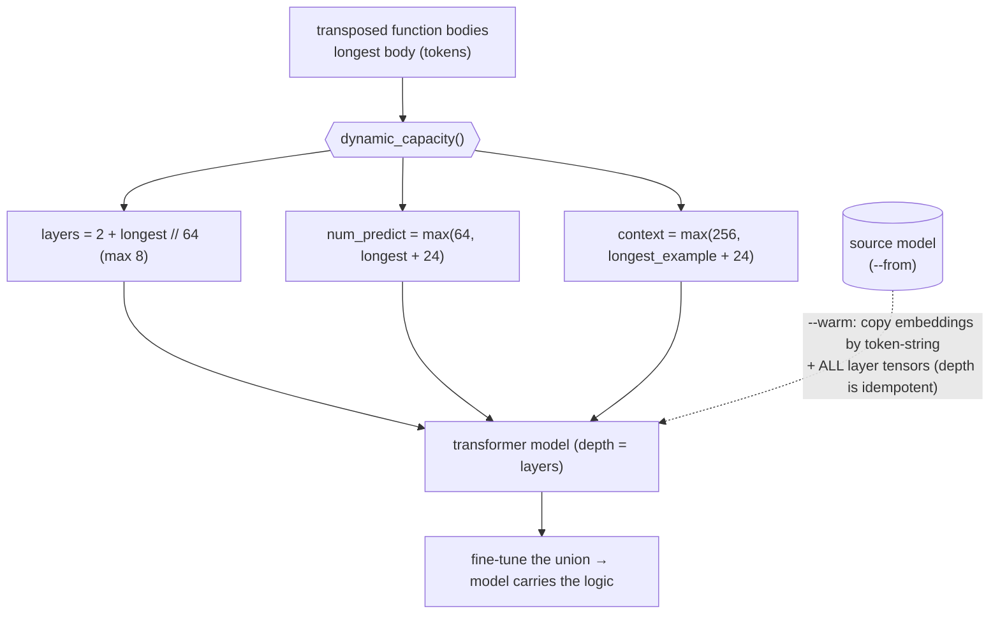

# Grammar-Driven Tiny LLMs — Local (Ollama) and On-NPU (STM32N6 Neural-ART)

Train tiny language models on your own knowledge, teach them BNF/EBNF grammars, and run them two ways from one grammar conceptualization: a multi-architecture transformer (qwen2 / qwen3 / llama / mistral) served locally via Ollama, and a Conv1D/TCN model running natively on the STM32N6570-DK Neural-ART NPU — plus a blackbox toolkit to reverse-engineer and security-audit any loadable model.

A framework for training tiny transformer language models — **qwen2** (default), **qwen3**, **llama**, or **mistral** via `--arch` — on custom knowledge, augmenting them with BNF/EBNF grammars, and serving them locally via Ollama — with an interactive CLI that auto-detects grammar input, executes OS routines through multi-step model interactions, and supports deep Tab completion across grammar trees.

It is **also a framework for the STM32N6 Neural-ART NPU** — the *same* grammar-and-training conceptualization, re-cast into an architecture the NPU can actually run. Because the Neural-ART is an INT8 conv/GEMM engine that cannot execute transformers, the framework trains a tiny causal **Conv1D / TCN** on the same BNF grammars and (prompt → answer) pairs, exports it to INT8 ONNX, and proves it compiles **100% to NPU hardware** (`stedgeai analyze`). It then generates the device C, so the trained grammar runs on-chip on the Neural-ART — the CPU doing tokenize/embed/detokenize and the NPU running the convolution body.

The result is **one grammar conceptualization, two device paths** — the transformer (qwen2 / qwen3 / llama / mistral) deployed to the Cortex-M55 **CPU**, and a Conv1D/TCN deployed natively to the Neural-ART **NPU** — each exercised by **one unified runner** (`scripts/model_runner.py`) in the mode that fits the path.

It also has a **nocode** evolution: instead of running a grammar's logic from hand-written CPU code, the working logic is *transposed into trainable tokens, carried inside the model, emitted at inference, and executed by a grammar-agnostic runner* (`scripts/nocode_runner.py`) — so a new or changed grammar needs **no per-grammar CPU code**. See [Nocode — Model-Carried Logic](#nocode--model-carried-logic) below.

> **All command usages** — install & setup, the unified runner, host→CPU and host→NPU deployment, grammar tools, and the blackbox Model Security RE — live in the **[User Guide](docs/USER_GUIDE.md)**. This README keeps the solution overview and the one entry-point command: `scripts/nocode_runner.py`.

# TOC

- [What it does](#what-it-does)
- [Architecture](#architecture)
- [Nocode — Model-Carried Logic](#nocode--model-carried-logic) (entry point: `nocode_runner.py`)
- [Documentation](#documentation) — all other commands
- [License](#license)

---

## What it does

The same grammar-and-training conceptualization drives two device paths — the transformer (qwen2 / qwen3 / llama / mistral) on the Cortex-M55 CPU, and an NPU-native Conv1D/TCN on the Neural-ART. A separate, independent toolkit reverse-engineers and security-audits any ready-to-load model (see the [User Guide § Security](docs/USER_GUIDE.md#security)).

### On the host — a tiny multi-architecture transformer served via Ollama

- **Builds a small transformer model** — `qwen2` (default), `qwen3`, `llama`, or `mistral` via `--arch` — from scratch using a custom BPE tokenizer trained over your own knowledge files and grammar rules.
- **Augments the model with BNF/EBNF grammars** — grammar rules become trained (prompt → answer) pairs so the model "knows" the grammar structure at inference time.
- **Runs grammar-driven interactions** via `GrammarRunner`: the model is queried once per unique grammar rule (cached), and the results drive either expression parsing or command execution.
- **Executes shell or Python code per token** — command vocabulary tokens can run shell commands (`_exec: shell`, default) or pure Python source (`_exec: python`) via `exec()`.
- **Auto-detects grammar input** at three depths: grammar name → sub-rule name → bare command token, including multi-word paths built by Tab completion.
- **Deep Tab completion** — pressing Tab walks deeper into the grammar tree on each press; falls back to a live model query when the playbook has no match.
- **Generates grammar files from external sources** (`scripts/model_generation/model_tools_grammar.py`) — convert Mermaid diagrams, Markdown runbooks, plain-text SOP documents, PDFs, and web pages into ready-to-load grammar + vocabulary files. AI-assisted extraction available via any Ollama model.
- **Accepts startup arguments** — inject extra training files or grammars at launch via `--train` / `--grammar`, or pass a list file with `@`.
- **External model mode** (`--model`) — attach any existing Ollama model or import a local `.gguf` file, skipping training entirely while keeping all grammar and vocabulary features.
- **Exports to GGUF** and serves via Ollama so any Ollama-compatible client can query the model.

### On the STM32N6 — Conv1D/TCN native on the Neural-ART NPU

- **Creates an NPU-native model from the same grammar** (`scripts/model_generation/model_create_npu_tcn.py`) — a tiny causal **Conv1D / TCN** trained on the *same* BNF grammar + (prompt → answer) pairs and reusing the *same* tokenizer, so the grammar conceptualization is identical; only the architecture changes (no transformer ops the NPU can't run).
- **Proves it runs 100% on NPU hardware** — `stedgeai analyze` confirms a pure-hardware mapping (no CPU software-fallback), unlike the transformer which the Neural-ART cannot execute.
- **Generates the device C** — `stedgeai generate` emits `network.c` / `network_data.c` that the STM32N6570-DK FSBL firmware consumes.
- **Generates the CPU embedding table** (`scripts/model_generation/emit_npu_embed_header.py`) — the int8 `llm_embed.h` lookup the CPU feeds to the NPU, quantized to that model's NPU input scale so the CPU embedding space matches the NPU conv weights.
- **Runs on-chip, autonomously** — the FSBL tokenizes, parses, evaluates AND drives the NPU entirely on the Cortex-M55 + Neural-ART; type `3 + 4` over UART and the edge device returns `7` by itself. The host **unified runner** in device mode is just a thin terminal that pushes prompts and collects output. *(Why it matters: the edge device does the whole job — no transformer, no host, no network.)*
- **Exports the host model to ONNX** — `/npu` or `scripts/model_generation/model_export_npu.py` produces FP32 + INT8 ONNX files ready for import into STM32Cube.AI Studio.

### Model Security RE — reverse-engineer a loadable model (host)

- **Analyzes a ready-to-load model as a blackbox** (`scripts/model_security_re.py`) — given only an Ollama model name or a `.gguf` file, it extracts the model's content and judges whether it encodes a command/code-execution capability, without trusting the client, training files, or HF source.
- **Static track (never loads the model)** — parses the GGUF artifact with `gguf-py`'s `GGUFReader`: format-safety triage (offset/size/overflow), metadata + tokenizer + tensor extraction, and an exec-capability pattern sweep.
- **Dynamic track (output is evidence, never executed)** — probes the live model over the Ollama API at temperature 0, reconstructs the BNF grammar from the responses, and scores recall against an offline oracle to confirm or clear static flags.
- **Composes a verdict** — `INERT` / `INCONCLUSIVE` / `EXECUTABLE-CAPABILITY`, written to `models/forensics/`. Independent analysis code (only `gguf-py` + the Ollama API), generalising across `qwen2` / `llama` / `mistral` GGUFs. Full guide: [User Guide § Security](docs/USER_GUIDE.md#security).

## Architecture

```
scripts/model_generation/
  model_create_hf_cl.py         # Entry point: trains the transformer, exports, serves, interactive CLI
  model_export_gguf.py          # Standalone GGUF export (host model → Ollama)
  model_export_npu.py           # Standalone NPU/ONNX export (transformer → INT8 ONNX for Cube.AI)
  model_create_npu_tcn.py       # NPU-NATIVE path: build/train Conv1D/TCN → ONNX → stedgeai analyze/generate
  emit_npu_embed_header.py      # Device CPU int8 embedding table (llm_embed.h) for the TCN model
  export_embed.py               # Emit network_embed.c/.h — int8 embedding table for run-23 FSBL
  export_tokens.py              # Emit network_tokens.c/.h — device decode table + rule prompts + EOS
  model_tools_grammar.py        # Grammar tool: converts external sources → grammar files

scripts/model_runner.py         # Official unified runner entry point (CLI over class_model_runner)
scripts/nocode_runner.py        # Nocode entry point: the model carries the logic, the runner executes it
scripts/model_security_re.py    # Model Security RE CLI: analyze | reconstruct | threat | integrity
scripts/model_security/         # Analyst toolkit package (acquire / reconstruct / threat / integrity / report)

scripts/classes/
  class_model_assets.py         # ModelAssets: knowledge accumulation + incremental rebuild
  class_model_grammar.py        # ModelGrammar: BNF/EBNF parser  |  GrammarRunner: execution engine
  class_model_runner.py         # Unified runner library: host (Ollama) | device (NPU-over-serial) — backs scripts/model_runner.py
  class_nocode_grammar.py       # NoCodeGrammarRunner: sources each body from the model + runs it
  class_model_security.py       # Deprecated shim → re-exports scripts/model_security/*
  class_terminal_logs.py        # Colour terminal logger
  class_tools_grammar.py        # Grammar converters: Mermaid / Markdown / Text / PDF / Web / AI

models/grammars/
  playbook_pyhealthcheck.txt    # Python healthcheck procedure grammar  ← default
  playbook_linux_healthcheck.txt   # Shell healthcheck procedure grammar
  playbook_model_calculator.txt    # Expression grammar: expr ::= expr "+" term | ...
  playbook_kali_discovery.txt      # Discovery grammar (generated from examples/grammar_sources)

models/training/
  train_python_healthcheck_commands.json  # Python token vocabulary (_exec: python)  ← default
  train_linux_healthcheck_commands.json   # Shell token vocabulary (_exec: shell)
  train_kali_discovery_commands.json      # Discovery token vocabulary (generated)

models/generated/               # Trained-model output tree (created at runtime)
  transformer/<name>/           # transformer weights + <name>.state.json + tokenizer + GGUF + Modelfile
  convolutional/<name>/         # TCN weights + tokenizer + ONNX (fp32 + int8)
models/npu_export/<name>/       # stedgeai analyze report + generated device C
models/forensics/               # Model Security RE working dir (reports, extracted artifacts)

STM32N6/AI_TO_NPU_1/run-23/          # live FSBL — autonomous NPU calculator firmware (STM32N6570-DK)
  FSBL/Core/Src/main.c               # NPU init + ASYNC runtime + autonomous UART calc> REPL
  FSBL/AI/grammar_runner.cpp         # C++ GrammarRunner port + per-token CPU<->NPU logging
  FSBL/AI/npu_query.c                # autoregressive NPU rule recall (embed -> conv -> argmax)
  FSBL/AI/network_embed.c            # int8 CPU embedding table (from export_embed.py)
  FSBL/AI/network_tokens.c           # device decode table + rule prompts (from export_tokens.py)

examples/
  grammar_sources/              # Example source files (one per supported format)
  llm_uart/                     # Device-side LLM-over-UART integration (FSBL): llm_npu, llm_tokenizer, llm_test
  test_grammar_tools.py         # Self-test for all grammar converters

docs/
  USER_GUIDE.md                 # Full reference: install, runner, host→CPU, host→NPU, security — all commands
  NOCODE_RUNNER.md              # Nocode deep-dive (model-carried logic)
  GRAMMAR_TOOLS.md              # Full reference for scripts/model_generation/model_tools_grammar.py
  STM32_NPU_DEPLOYMENT.md       # End-to-end host → ST Edge AI → on-device FSBL NPU deployment
  MODEL_SECURITY_RE.md          # Blackbox Model Security RE — static + dynamic analysis guide
```

# Nocode — Model-Carried Logic

**The model carries the code.** The baseline runs a grammar's logic from hand-written CPU code — the
hardcoded `GrammarRunner.evaluate()` (expression grammars) or a side-car command vocabulary
(procedure grammars). The **nocode** track inverts that coupling: the working logic is *transposed
into trainable tokens*, trained into the model as `("<grammar> <token>" → body)` anchors, **emitted by
the model** at inference, and executed by a **grammar-agnostic runner** — so a new or changed grammar
needs **no per-grammar CPU code**. Runtime infrastructure: the runner, Ollama, and the model.

```
baseline:  grammar ──> CPU code (hardcoded / side-car) ──> result
nocode:    grammar ──> model carries logic ──> model emits body ──> nocode_runner runs it ──> result
```

The proven `model_runner.py` baseline is untouched; nocode is an additive parallel track
(`NoCodeGrammarRunner` subclasses `GrammarRunner`).

## How the model emits runnable code

| Piece | File |
|---|---|
| Transpose CPU logic → `function_vocabulary` | `scripts/classes/class_logic_transposer.py` + `scripts/model_generation/emit_logic_vocab.py` |
| Train the bodies as anchors (+ dynamic capacity) | `scripts/model_generation/model_create_hf_cl.py` |
| Source each body from the model + run it | `scripts/classes/class_nocode_grammar.py` |
| Host runner (auto-detect, `--policy`) | `scripts/nocode_runner.py` |
| Live regression (3 policies) | `scripts/model_generation/nocode_verify_calc.py` |

**Exec policy ladder** (`--policy` / `/policy`): `token_select` (vocab only) → `vocab_verified` (model
emits, verified fallback — default) → `generative` (run the model-emitted body — the destiny).

**Keeping bodies small enough to carry** (routed by the code-review gate, 240 chars / 6 lines):
within budget → as-is · over budget & factorable → **decompose** into small per-operation tokens ·
over budget & atomic → **continuity** `[[CONT]]`/`[[END]]` chunking (runner reassembles the whole body).
**Model depth (layers) scales with the logic.** `dynamic_capacity()` sizes the model's neural depth,
emission window and context to the *longest body* the model must carry — from a **fixed base** so the
result is idempotent (re-forking/upgrading never compounds extra layers, and a `--warm` start can reuse
every layer):



| Grammar set | longest body | layers | num_predict |
|---|---|---|---|
| calculator ops (decomposed) | ~21 tok | 2 | 64 |
| fibonacci / greeting | ~73 tok | 3 | 97 |
| pyhealthcheck (big bodies) | ~155 tok | 4 | 179 |

Small grammars stay lean; bigger logic grows depth + window; a warm fork/upgrade reuses the source's
layers so it converges from what was already learned. Full detail: [docs/NOCODE_RUNNER.md](docs/NOCODE_RUNNER.md).

## Run it

```bash
source venv/bin/activate

# transpose + review + train
python3 scripts/model_generation/emit_logic_vocab.py --grammar calculator --decompose --review
python3 scripts/model_generation/model_create_hf_cl.py --build-only \
    --name model_calculator_nocode_v1 --grammar models/grammars/playbook_model_calculator.txt

# run — the model supplies the logic; nocode_runner executes it
python3 scripts/nocode_runner.py --mode host \
    --grammar models/grammars/playbook_model_calculator.txt \
    --model model_calculator_nocode_v1 --policy generative
```

```
nocode> 3 + 4         # expression  → evaluate-mode  → Result: 7   (op bodies fetched from the model)
nocode> fibonacci     # command name → execute-mode  → runs the procedure (model-emitted python)
```

### nocode CLI at a glance

| Command | What it does |
|---|---|
| `nocode_runner.py [--model M] [--grammar F…] [--policy P]` | run a model-carried grammar; omit `--model`→script-named default, omit `--grammar`→auto-load from the model's `state.json` |
| `nocode_runner.py --grammar a.txt b.txt c.txt` | load **multiple** grammars (composition: one grammar can call others) |
| in-session: `<expr>` / `<name>` · `/policy` · `/grammar` · `/set` · `/create` · `/?` · `/bye` · `TAB` | evaluate / execute · set policy · switch grammars · config · retrain · help · quit · completion+history |
| `emit_logic_vocab.py --grammar G [--decompose] [--review]` | transpose a grammar's CPU logic into a trainable function vocabulary |
| `model_create_hf_cl.py --build-only --name M [--from S] [--warm] --grammar F…` | build / **fork** (`--from`) / **warm-upgrade** (`--warm`) a model |

Full reference: **[docs/NOCODE_RUNNER.md § CLI & REPL reference](docs/NOCODE_RUNNER.md#cli--repl-reference)**.

**Proven live:** calculator (all 3 policies 6/6 incl. `generative`), fibonacci (execute-mode
generative — model emits the python bodies, runner prints `0 1 1 2 … 377`). kali (`_exec=shell`)
proven by resolution (no scans run).

**Also supported:** **grammar composition** (one grammar calls others; one model carries many),
**per-model config** (`--model X` auto-loads its grammars; plain `nocode_runner.py` → script-named
default), **fork + warm upgrade** (`--from` / `--warm`), **multi-architecture creation**
(`--arch qwen2|qwen3|llama|mistral` — the same grammar pipeline on any base family), and
**function arguments + inter-function data flow** (`<tool> <arg…>` at the prompt; one function
gathers data and injects it into the next). Full reference: **[docs/NOCODE_RUNNER.md](docs/NOCODE_RUNNER.md)**.

---

# Documentation

Everything else — **install & setup** (venv, PyTorch, Ollama, GPU), the **unified runner**
(`scripts/model_runner.py`) with its modes/commands, **host→CPU** and **host→NPU (STM32N6 Neural-ART)**
deployment, **grammar tools**, and the blackbox **Model Security RE** — with all command usages, lives
in the **[User Guide](docs/USER_GUIDE.md)**.

Deep-dive references: [Nocode Runner](docs/NOCODE_RUNNER.md) · [Grammar Tools](docs/GRAMMAR_TOOLS.md) · [STM32 NPU Deployment](docs/STM32_NPU_DEPLOYMENT.md) · [Model Security RE](docs/MODEL_SECURITY_RE.md)

# License

MIT — see [LICENSE](LICENSE).
