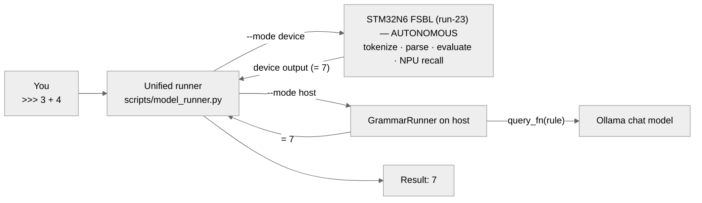

# Grammar-Driven Tiny LLMs — Local (Ollama) and On-NPU (STM32N6 Neural-ART)

Train tiny language models on your own knowledge, teach them BNF/EBNF grammars, and run them two ways from one grammar conceptualization: a Qwen2 model served locally via Ollama, and a Conv1D/TCN model running natively on the STM32N6570-DK Neural-ART NPU — plus a blackbox toolkit to reverse-engineer and security-audit any loadable model.

A framework for training tiny Qwen2 language models on custom knowledge, augmenting them with BNF/EBNF grammars, and serving them locally via Ollama — with an interactive CLI that auto-detects grammar input, executes OS routines through multi-step model interactions, and supports deep Tab completion across grammar trees.

It is **also a framework for the STM32N6 Neural-ART NPU** — the *same* grammar-and-training conceptualization, re-cast into an architecture the NPU can actually run. Because the Neural-ART is an INT8 conv/GEMM engine that cannot execute transformers, the framework trains a tiny causal **Conv1D / TCN** on the same BNF grammars and (prompt → answer) pairs, exports it to INT8 ONNX, and proves it compiles **100% to NPU hardware** (`stedgeai analyze`). It then generates the device C, so the trained grammar runs on-chip on the Neural-ART — the CPU doing tokenize/embed/detokenize and the NPU running the convolution body.

The result is **one grammar conceptualization, two device paths** — the Qwen2 transformer deployed to the Cortex-M55 **CPU**, and a Conv1D/TCN deployed natively to the Neural-ART **NPU** — each exercised by **one unified runner** (`scripts/model_runner.py`) in the mode that fits the path.

It also has a **nocode** evolution: instead of running a grammar's logic from hand-written CPU code, the working logic is *transposed into trainable tokens, carried inside the model, emitted at inference, and executed by a grammar-agnostic runner* (`scripts/nocode_runner.py`) — so a new or changed grammar needs **no per-grammar CPU code**. See [Nocode — Model-Carried Logic](#nocode--model-carried-logic) and [docs/NOCODE_RUNNER.md](docs/NOCODE_RUNNER.md).

# TOC

- [Install & Info](#install--info)
- [Runner](#runner)
- [Nocode — Model-Carried Logic](#nocode--model-carried-logic)
- [Host Model to CPU Device](#host-model-to-cpu-device)
- [Host Model to NPU Device](#host-model-to-npu-device)
- [Security](#security)
- [License](#license)

---

# Install & Info

## What it does

The same grammar-and-training conceptualization drives two device paths — the Qwen2 transformer on the Cortex-M55 CPU, and an NPU-native Conv1D/TCN on the Neural-ART. A separate, independent toolkit reverse-engineers and security-audits any ready-to-load model (see [Security](#security)).

### On the host — tiny Qwen2 served via Ollama

- **Builds a small Qwen2 model** from scratch using a custom BPE tokenizer trained over your own knowledge files and grammar rules.
- **Augments the model with BNF/EBNF grammars** — grammar rules become trained (prompt → answer) pairs so the model "knows" the grammar structure at inference time.
- **Runs grammar-driven interactions** via `GrammarRunner`: the model is queried once per unique grammar rule (cached), and the results drive either expression parsing or command execution.
- **Executes shell or Python code per token** — command vocabulary tokens can run shell commands (`_exec: shell`, default) or pure Python source (`_exec: python`) via `exec()`.
- **Auto-detects grammar input** at three depths: grammar name → sub-rule name → bare command token, including multi-word paths built by Tab completion.
- **Deep Tab completion** — pressing Tab walks deeper into the grammar tree on each press; falls back to a live model query when the playbook has no match.
- **Generates grammar files from external sources** (`scripts/model_generation/model_tools_grammar.py`) — convert Mermaid diagrams, Markdown runbooks, plain-text SOP documents, PDFs, and web pages into ready-to-load grammar + vocabulary files. AI-assisted extraction available via any Ollama model.
- **Accepts startup arguments** — inject extra training files or grammars at launch via `--train` / `--grammar`, or pass a list file with `@`.
- **External model mode** (`--model`) — attach any existing Ollama model or import a local `.gguf` file, skipping training entirely while keeping all grammar and vocabulary features.
- **Exports to GGUF** and serves via Ollama so any Ollama-compatible client can query the model.

### On the STM32N6 — Conv1D/TCN native on the Neural-ART NPU

- **Creates an NPU-native model from the same grammar** (`scripts/model_generation/model_create_npu_tcn.py`) — a tiny causal **Conv1D / TCN** trained on the *same* BNF grammar + (prompt → answer) pairs and reusing the *same* tokenizer, so the grammar conceptualization is identical; only the architecture changes (no transformer ops the NPU can't run).
- **Proves it runs 100% on NPU hardware** — `stedgeai analyze` confirms a pure-hardware mapping (no CPU software-fallback), unlike the Qwen2 transformer which the Neural-ART cannot execute.
- **Generates the device C** — `stedgeai generate` emits `network.c` / `network_data.c` that the STM32N6570-DK FSBL firmware consumes.
- **Generates the CPU embedding table** (`scripts/model_generation/emit_npu_embed_header.py`) — the int8 `llm_embed.h` lookup the CPU feeds to the NPU, quantized to that model's NPU input scale so the CPU embedding space matches the NPU conv weights.
- **Runs on-chip, autonomously** — the FSBL tokenizes, parses, evaluates AND drives the NPU entirely on the Cortex-M55 + Neural-ART; type `3 + 4` over UART and the edge device returns `7` by itself. The host **unified runner** in device mode is just a thin terminal that pushes prompts and collects output. *(Why it matters: the edge device does the whole job — no transformer, no host, no network.)*
- **Exports the host model to ONNX** — `/npu` or `scripts/model_generation/model_export_npu.py` produces FP32 + INT8 ONNX files ready for import into STM32Cube.AI Studio.

### Model Security RE — reverse-engineer a loadable model (host)

- **Analyzes a ready-to-load model as a blackbox** (`scripts/model_security_re.py`) — given only an Ollama model name or a `.gguf` file, it extracts the model's content and judges whether it encodes a command/code-execution capability, without trusting the client, training files, or HF source.
- **Static track (never loads the model)** — parses the GGUF artifact with `gguf-py`'s `GGUFReader`: format-safety triage (offset/size/overflow), metadata + tokenizer + tensor extraction, and an exec-capability pattern sweep.
- **Dynamic track (output is evidence, never executed)** — probes the live model over the Ollama API at temperature 0, reconstructs the BNF grammar from the responses, and scores recall against an offline oracle to confirm or clear static flags.
- **Composes a verdict** — `INERT` / `INCONCLUSIVE` / `EXECUTABLE-CAPABILITY`, written to `models/forensics/`. Independent analysis code (only `gguf-py` + the Ollama API), generalising across `qwen2` / `llama` / `mistral` GGUFs. Full guide: [docs/MODEL_SECURITY_RE.md](docs/MODEL_SECURITY_RE.md).

## Architecture

```
scripts/model_generation/
  model_create_hf_cl.py         # Entry point: trains Qwen2, exports, serves, interactive CLI
  model_export_gguf.py          # Standalone GGUF export (host model → Ollama)
  model_export_npu.py           # Standalone NPU/ONNX export (Qwen2 → INT8 ONNX for Cube.AI)
  model_create_npu_tcn.py       # NPU-NATIVE path: build/train Conv1D/TCN → ONNX → stedgeai analyze/generate
  emit_npu_embed_header.py      # Device CPU int8 embedding table (llm_embed.h) for the TCN model
  export_embed.py               # Emit network_embed.c/.h — int8 embedding table for run-23 FSBL
  export_tokens.py              # Emit network_tokens.c/.h — device decode table + rule prompts + EOS
  model_tools_grammar.py        # Grammar tool: converts external sources → grammar files

scripts/model_runner.py         # Official unified runner entry point (CLI over class_model_runner)
scripts/model_security_re.py    # Model Security RE CLI: analyze | reconstruct | threat | integrity
scripts/model_security/         # Analyst toolkit package (acquire / reconstruct / threat / integrity / report)

scripts/classes/
  class_model_assets.py         # ModelAssets: knowledge accumulation + incremental rebuild
  class_model_grammar.py        # ModelGrammar: BNF/EBNF parser  |  GrammarRunner: execution engine
  class_model_runner.py         # Unified runner library: host (Ollama) | device (NPU-over-serial) — backs scripts/model_runner.py
  class_model_security.py       # Deprecated shim → re-exports scripts/model_security/*
  class_terminal_logs.py        # Colour terminal logger
  class_tools_grammar.py        # Grammar converters: Mermaid / Markdown / Text / PDF / Web / AI

models/grammars/
  playbook_pyhealthcheck.txt    # Python healthcheck procedure grammar  ← default
  playbook_linux_healthcheck.txt   # Shell healthcheck procedure grammar
  playbook_model_calculator.txt    # Expression grammar: expr ::= expr "+" term | ...
  playbook_kali_discovery.txt      # Discovery grammar (generated from examples/grammar_sources)

models/training/
  train_python_healthcheck_commands.json  # Python token vocabulary (_exec: python)  ← default
  train_linux_healthcheck_commands.json   # Shell token vocabulary (_exec: shell)
  train_kali_discovery_commands.json      # Discovery token vocabulary (generated)

models/generated/               # Trained-model output tree (created at runtime)
  transformer/<name>/           # Qwen2 weights + <name>.state.json + tokenizer + GGUF + Modelfile
  convolutional/<name>/         # TCN weights + tokenizer + ONNX (fp32 + int8)
models/npu_export/<name>/       # stedgeai analyze report + generated device C
models/forensics/               # Model Security RE working dir (reports, extracted artifacts)

STM32N6/AI_TO_NPU_1/run-23/          # live FSBL — autonomous NPU calculator firmware (STM32N6570-DK)
  FSBL/Core/Src/main.c               # NPU init + ASYNC runtime + autonomous UART calc> REPL
  FSBL/AI/grammar_runner.cpp         # C++ GrammarRunner port + per-token CPU<->NPU logging
  FSBL/AI/npu_query.c                # autoregressive NPU rule recall (embed -> conv -> argmax)
  FSBL/AI/network_embed.c            # int8 CPU embedding table (from export_embed.py)
  FSBL/AI/network_tokens.c           # device decode table + rule prompts (from export_tokens.py)

examples/
  grammar_sources/              # Example source files (one per supported format)
    kali_discovery.mmd          # Mermaid: local + network discovery (flowchart + %% cmd:)
    kali_discovery.md           # Markdown: same grammar, H2/H3/bullet format
    kali_discovery_spec.txt     # Plain text SOP: same grammar, numbered sections
    disk_maintenance.md         # Markdown: disk health checks (shell exec)
    python_sysinfo.md           # Markdown: system info via Python (python exec)
    network_scan.mmd            # Mermaid: network scan procedure
  llm_uart/                     # Device-side LLM-over-UART integration (FSBL): llm_npu, llm_tokenizer, llm_test
  test_grammar_tools.py         # Self-test for all grammar converters

docs/
  GRAMMAR_TOOLS.md              # Full reference for scripts/model_generation/model_tools_grammar.py
  STM32_NPU_DEPLOYMENT.md       # End-to-end host → ST Edge AI → on-device FSBL NPU deployment
  MODEL_SECURITY_RE.md          # Blackbox Model Security RE — static + dynamic analysis guide
```

## Prerequisites

- Python 3.10+
- [Ollama](https://ollama.com) installed and running (`ollama serve`)
- NVIDIA GPU recommended (CPU inference works but is slow)

### STM32N6 NPU device firmware (optional — runs the grammar model on-chip)

Building the FSBL firmware that runs the TCN grammar model on the STM32N6570-DK
Neural-ART NPU needs the ARM bare-metal toolchain **plus the C++ standard library
for the target** (the device-side grammar runner uses `std::vector` / `std::map` /
`std::string`):

```bash
sudo apt install gcc-arm-none-eabi binutils-arm-none-eabi \
                 picolibc-arm-none-eabi libstdc++-arm-none-eabi
```

> **`libstdc++-arm-none-eabi` is required and easy to miss** — the base
> `gcc-arm-none-eabi` package ships the C++ *compiler* but **not** libstdc++ for the
> ARM target, so `#include <vector>` fails to compile until this package is installed.

Also needs [ST Edge AI](https://www.st.com/en/development-tools/stedgeai-core.html)
(`stedgeai`, to compile the model to device C) and the ST-LINK GDB server (flash/debug).

## GPU support

The code auto-detects the best available compute device at startup (priority: CUDA → MPS → CPU) and trains on it automatically. No configuration required.

** tested on CPU only, not tested with supported GPU **

| Platform | Device | Notes |
|---|---|---|
| NVIDIA GPU | `cuda` | Install PyTorch with the matching CUDA wheel (see Setup) |
| Apple Silicon | `mps` | Install the standard CPU/MPS PyTorch wheel |
| CPU-only | `cpu` | Default fallback — works everywhere, slower training |
| AMD GPU | `cpu` | Requires ROCm + a ROCm-built PyTorch wheel; see [pytorch.org/get-started](https://pytorch.org/get-started/locally/) |

## Setup

```bash
# 1. Clone the repo
git clone <repo-url> && cd <repo-dir>

# 2. Create a virtual environment
python3 -m venv venv
source venv/bin/activate        # Windows: venv\Scripts\activate

# 3. Install PyTorch (with CUDA — adjust cu121 to match your driver)
pip install torch --index-url https://download.pytorch.org/whl/cu121

# 4. Install remaining dependencies
pip install -r requirements.txt

# 5. Start Ollama
ollama serve &
```

---

# Runner

The **unified runner** [`scripts/model_runner.py`](scripts/model_runner.py) (a thin CLI over
[`scripts/classes/class_model_runner.py`](scripts/classes/class_model_runner.py)) is the single
management hub for the whole solution: it runs the grammar model (on the host or on the autonomous
device) and, from the same REPL, **creates/exports** the NPU model (`/create` `/export`) and runs
**security analysis** (`/security`) — all driven by one config file.

## Configuration — single source of truth

All runner/CLI-manageable defaults live in one file:
[`scripts/model_runner_config.json`](scripts/model_runner_config.json). The scripts themselves hold
**only** structural folders, naming/call logic, and the model **architecture**
(`embed_dim` / `seq_len` / `kernel`) — **no user values are hardcoded**. Path values are stored as
*atoms* (a grammar filename, a tokenizer name) and composed with the structural folders inside the
scripts (e.g. `models/grammars/` + `<grammar atom>`).

Three equivalent ways to manage config (same keys everywhere):

| Where | How |
|---|---|
| Config file | edit `scripts/model_runner_config.json` (the defaults) |
| CLI flags | `--grammar`, `--name`, `--epochs`, `--sec-out`, … at launch |
| Live in the REPL | `/set <key> <value>`, `/get <key>`, `/config` |

```
>>> /config                 # runtime + builder + security config
>>> /set epochs 800
>>> /set model my-ollama-model
>>> /set sec_dynamic true
```

Architecture keys have no value in the config file — their default lives in the worker
(`model_create_npu_tcn.py`); `/set` still overrides them.

## Modes

| Mode | Launch | What runs where |
|---|---|---|
| **host** | `--mode host --model <ollama>` | the host runs `GrammarRunner`; Ollama is the grammar oracle (needs the venv) |
| **device** | `--mode device --port <port>` | thin serial terminal to the **autonomous** STM32N6 (dependency-free, pure serial) |

## Commands

Every command is available in both modes (mode-specific ones are gated):

| Input | Description |
|---|---|
| `<expression>` | device: pushed to the autonomous device; host: parsed + evaluated locally |
| `/set <k> <v>` | set a config value (runtime / builder / security) |
| `/get [k]` · `/config` | show one / all config values |
| `/grammar` | print the active BNF grammar |
| `/create` | build: train + export the NPU-native TCN — see [Host Model to NPU Device](#host-model-to-npu-device) |
| `/export` | build: re-export only (`--export-only`) |
| `/security [sub]` | blackbox model analysis — see [Security](#security) (`analyze`/`reconstruct`/`threat`/`integrity`) |
| `/rules` | *(host only)* recall every grammar rule via the Ollama oracle |
| `/mode` | show the active mode + key config |
| `/?` · `/bye` | help · quit (in device mode the device keeps running standalone) |

## Running

```bash
# device mode — thin terminal to the autonomous STM32N6 (run-23 FSBL loaded/flashed)
python3 scripts/model_runner.py --mode device --port /dev/ttyACM0

# host mode — GrammarRunner local + Ollama oracle (from the project venv)
source venv/bin/activate
python3 scripts/model_runner.py --mode host --model model_calculator_test_npu
```



## Manage models & security from the runner

From the same REPL, with config supplied by `/set` (or the config file / CLI):

```
>>> /set name model_calc_tcn_v2
>>> /set epochs 800
>>> /create                       # → model_create_npu_tcn.py --name model_calc_tcn_v2 --epochs 800 …
>>> /export                       # re-export only (--export-only)

>>> /set model model_calculator_test_npu
>>> /security analyze --dynamic   # → model_security_re.py analyze --ollama … --dynamic
```

`/create`/`/export` build the NPU model (full pipeline in [Host Model to NPU Device](#host-model-to-npu-device));
`/security` runs the blackbox analyzer (detail in [Security](#security)). Both run as subprocesses, so
**device mode stays dependency-free**. Security options are config-managed too
(`sec_gguf`/`sec_out`/`sec_registry`/`sec_assets`/`sec_dynamic`), forwarded subcommand-aware.

> The **host model** itself (the Qwen2 grammar model and its interactive training CLI,
> `model_create_hf_cl.py`) is documented under [Host Model to CPU Device](#host-model-to-cpu-device);
> the unified runner above is the operational hub that drives, builds and audits models.

---

# Nocode — Model-Carried Logic

**The model carries the code.** The baseline runs a grammar's logic from hand-written CPU code — the
hardcoded `GrammarRunner.evaluate()` (expression grammars) or a side-car command vocabulary
(procedure grammars). The **nocode** track inverts that coupling: the working logic is *transposed
into trainable tokens*, trained into the model as `("<grammar> <token>" → body)` anchors, **emitted by
the model** at inference, and executed by a **grammar-agnostic runner** — so a new or changed grammar
needs **no per-grammar CPU code**. Runtime infrastructure: the runner, Ollama, and the model.

```
baseline:  grammar ──> CPU code (hardcoded / side-car) ──> result
nocode:    grammar ──> model carries logic ──> model emits body ──> nocode_runner runs it ──> result
```

The proven `model_runner.py` baseline is untouched; nocode is an additive parallel track
(`NoCodeGrammarRunner` subclasses `GrammarRunner`).

## How the model emits runnable code

| Piece | File |
|---|---|
| Transpose CPU logic → `function_vocabulary` | `scripts/classes/class_logic_transposer.py` + `scripts/model_generation/emit_logic_vocab.py` |
| Train the bodies as anchors (+ dynamic capacity) | `scripts/model_generation/model_create_hf_cl.py` |
| Source each body from the model + run it | `scripts/classes/class_nocode_grammar.py` |
| Host runner (auto-detect, `--policy`) | `scripts/nocode_runner.py` |
| Live regression (3 policies) | `scripts/model_generation/nocode_verify_calc.py` |

**Exec policy ladder** (`--policy` / `/policy`): `token_select` (vocab only) → `vocab_verified` (model
emits, verified fallback — default) → `generative` (run the model-emitted body — the destiny).

**Keeping bodies small enough to carry** (routed by the code-review gate, 240 chars / 6 lines):
within budget → as-is · over budget & factorable → **decompose** into small per-operation tokens ·
over budget & atomic → **continuity** `[[CONT]]`/`[[END]]` chunking (runner reassembles the whole body).
Dynamic capacity grows depth / `num_predict` with the longest body trained in (calculator stays lean
2 layers / 64; pyhealthcheck grows to 4 layers / 179).

## Run it

```bash
source venv/bin/activate

# transpose + review + train
python3 scripts/model_generation/emit_logic_vocab.py --grammar calculator --decompose --review
python3 scripts/model_generation/model_create_hf_cl.py --build-only \
    --name model_calculator_nocode_v1 --grammar models/grammars/playbook_model_calculator.txt

# run — the model supplies the logic; nocode_runner executes it
python3 scripts/nocode_runner.py --mode host \
    --grammar models/grammars/playbook_model_calculator.txt \
    --model model_calculator_nocode_v1 --policy generative
```

```
nocode> 3 + 4         # expression  → evaluate-mode  → Result: 7   (op bodies fetched from the model)
nocode> fibonacci     # command name → execute-mode  → runs the procedure (model-emitted python)
```

**Proven live:** calculator (all 3 policies 6/6 incl. `generative`), fibonacci (execute-mode
generative — model emits the python bodies, runner prints `0 1 1 2 … 377`). kali (`_exec=shell`)
proven by resolution (no scans run). Full reference: **[docs/NOCODE_RUNNER.md](docs/NOCODE_RUNNER.md)**.

---

# Host Model to CPU Device

**Path: Qwen2 transformer → STM32N6570-DK Cortex-M55 CPU.** This is the baseline path: you build and
operate a tiny Qwen2 grammar model on the host, then deploy it to the STM32N6 where — because the
Neural-ART NPU cannot execute transformer ops — it runs on the **Cortex-M55 CPU** via ST Edge AI's
software-fallback path. For a model that runs *natively on the NPU*, see
[Host Model to NPU Device](#host-model-to-npu-device).

## Build & run the host model

```bash
source venv/bin/activate
python scripts/model_generation/model_create_hf_cl.py
```

On the **first run** the script:
1. Trains a BPE tokenizer + Qwen2 model over the startup knowledge files and grammar rules.
2. Exports a GGUF file and registers it with Ollama.
3. Runs a self-test against the two canonical colour prompts.
4. Opens the interactive CLI.

On subsequent runs the saved state is restored and the model is re-exported without retraining.

> **Fresh start:** delete the saved model directory to force a full retrain. The
> state lives inside the generated model folder, not at the repo root:
> ```bash
> rm -rf models/generated/transformer/model_discoverit_version_1/
> ```
> (The default model name is `model_discoverit_version_<version>` — see
> `model_create` / `STATE_PATH` in `scripts/model_generation/model_create_hf_cl.py`.)

### Startup arguments

Extra training files and grammars can be injected at launch without editing `INIT_KNOWLEDGE_FILES`.

```bash
# Load one or more training/knowledge files before the built-in defaults
python scripts/model_generation/model_create_hf_cl.py --train training/notes.md training/extra.json

# Load additional grammar files
python scripts/model_generation/model_create_hf_cl.py --grammar grammars/mygrammar.bnf

# Combine both
python scripts/model_generation/model_create_hf_cl.py --train training/notes.md --grammar grammars/mygrammar.bnf

# Pass a list file (one argument per line, prefix with @)
python scripts/model_generation/model_create_hf_cl.py @startup_args.txt
```

**Load order:** `--train` files → `--grammar` files → built-in `INIT_KNOWLEDGE_FILES` defaults.

On a **restored state** the CLI files are applied on top of the saved knowledge, so you can extend an existing session without retraining from scratch.

**List file format** (`startup_args.txt`):
```
--train
training/notes.md
training/extra.json
--grammar
grammars/mygrammar.bnf
```

Short flags `-t` / `-g` work as aliases for `--train` / `--grammar`.

### External model mode

Use any Ollama model — or a local `.gguf` file — without training:

```bash
# Use a model already registered in Ollama
python scripts/model_generation/model_create_hf_cl.py --model qwen2:7b
python scripts/model_generation/model_create_hf_cl.py -m llama3

# Import a local GGUF file into Ollama, then use it
python scripts/model_generation/model_create_hf_cl.py --model ./path/to/model.gguf

# Combine with grammar/vocabulary files
python scripts/model_generation/model_create_hf_cl.py --model qwen2:7b \
    --train models/training/train_python_healthcheck_commands.json \
    --grammar models/grammars/playbook_pyhealthcheck.txt
```

If the name is not found in Ollama and is not a `.gguf` file, the script lists available models and exits.

**What works in external model mode:**

| Feature | Available |
|---|---|
| Chat (queries external model) | ✅ |
| Tab completion (grammar tree) | ✅ |
| Grammar auto-detect (all three depths) | ✅ |
| `/grammar`, `/read` vocabulary JSON | ✅ |
| `/context`, `/tokens` | ✅ |
| `/read` markdown (in-flight learning) | ❌ requires trained model |
| `/npu` export | ❌ requires trained model weights |

## Interactive CLI

Launching the host runner (`python scripts/model_generation/model_create_hf_cl.py`)
trains/restores the Qwen2 model and then drops to a `>>>` prompt. From there you can run
grammars, evaluate expressions, chat with the model, train knowledge in-flight, and
export to the device. Type `/?` for the command list:

```
>>> /?
```

The prompt accepts both **bare input** (auto-detected — see [Auto-detect modes](#auto-detect-modes))
and **slash commands**:

| Input | Description |
|---|---|
| `<grammar / rule / token>` | Auto-detect and run a loaded grammar, a sub-rule, or a command token |
| `<expression>` | Parse + evaluate against loaded grammars (e.g. `3 + 4 * 2`) |
| `<any other text>` | Chat with the model — fallback when no grammar/expression matches |
| `/?` | Show this help |
| `/grammar <file>` | Load a BNF/EBNF grammar file and augment the model in-flight |
| `/read <file>` | Train a markdown / JSON knowledge file into the model in-flight |
| `/run [grammar] <expr>` | Parse and evaluate an expression, or execute a procedure grammar |
| `/npu [dir]` | Export model to ONNX for STM32Cube.AI / STM32N6570-DK (default: `models/npu_export/`) |
| `/context` | Show all loaded files, command vocabularies, exec modes, and knowledge document count |
| `/tokens [grammar]` | Show grammar rules and token commands (all grammars, or filter by name) |
| `/bye` (or `exit`, `quit`) | Exit the CLI |
| `TAB` | Multi-level grammar tree completion; live model query fallback |

> **Note** — this is the host-model CLI (`model_create_hf_cl.py`). To run the same grammar against
> the autonomous NPU device, use the unified runner in device mode — see [Runner](#runner)
> (§ [Modes](#modes), § [Running](#running)).

### Tab completion

Tab walks one level deeper into the grammar tree on each press:

```
>>> <TAB>
pyhealthcheck  /?  /read  /grammar  /run  /npu  /context  /tokens  /bye

>>> pyhealthcheck <TAB>
py_system_status  py_resource_status  py_network_status

>>> pyhealthcheck py_system_status <TAB>
py_check_kernel  py_check_uptime  py_check_services

>>> pyhealthcheck py_system_status py_check<TAB>
py_check_kernel  py_check_uptime  py_check_services
```

When the playbook has no match at that depth, Tab falls back to a live Ollama query so the model's trained knowledge fills in the gaps.

CLI command arguments also complete:
```
>>> /run <TAB>          → grammar names
>>> /tokens <TAB>       → grammar names
```

### Auto-detect modes

Three detection depths, checked in order:

**1. Grammar name** — type the grammar root name to run the full procedure:
```
>>> pyhealthcheck
Auto-detected 'pyhealthcheck' procedure — executing grammar...
[exec/py] py_check_kernel
--- kernel / runtime ---
Kernel : 6.x.x-amd64
Python : 3.x.x
...
```

**2. Multi-word path** — type grammar name + any sub-rule or token (what Tab builds up); the last word is the target:
```
>>> pyhealthcheck py_system_status
Auto-detected path 'pyhealthcheck → py_system_status' — executing sub-procedure...

>>> pyhealthcheck py_system_status py_check_uptime
Auto-detected path 'pyhealthcheck → py_system_status → py_check_uptime' — running command token...
```

**3. Bare rule or token name** — type a single rule name or command token from any loaded grammar:
```
>>> py_system_status
Auto-detected 'py_system_status' rule in 'pyhealthcheck' — executing sub-procedure...

>>> py_check_kernel
Auto-detected command token 'py_check_kernel' in 'pyhealthcheck' — running command...
```

**4. Expression parse** — type any expression and the parser tries it against all loaded grammars:
```
>>> 3 + 4 * 2
Auto-detected 'calculator' expression — running grammar...
Result: 11
```

Falls through to normal chat if none of the four modes match.

### /context

Shows all runtime state — what's loaded, in what mode, how many tokens:

```
>>> /context

=== Context ===

Startup files (INIT_KNOWLEDGE_FILES):
  models/training/train_python_healthcheck_commands.json
  models/grammars/playbook_pyhealthcheck.txt

Command vocabularies:
  pyhealthcheck  [exec=python]  8 token(s)
    py_check_kernel  py_check_uptime  py_check_cpu  py_check_memory
    py_check_disk  py_check_processes  py_check_services  py_check_ports

Playbook grammars:
  pyhealthcheck  12 rule(s)

Knowledge memory: 2 prose document(s)
```

### /tokens

Shows grammar rules and the full source of each command token:

```
>>> /tokens pyhealthcheck

=== Grammar: pyhealthcheck  [exec=python] ===

Rules:
  <pyhealthcheck      >  ::=  py_system_status py_resource_status py_network_status
  <py_system_status   >  ::=  py_check_kernel py_check_uptime py_check_services
  ...

Tokens:
  py_check_kernel:
    import platform, sys
    print('--- kernel / runtime ---')
    print('Kernel :', platform.release())
    ...
```

Without an argument, `/tokens` dumps all loaded grammars.

## Command execution modes

Grammar token values can be shell commands or pure Python source. The mode is set by `"_exec"` in the command vocabulary JSON.

### Shell mode (default)

```json
{
  "_type": "command_vocabulary",
  "_grammar": "mycheck",
  "step_one": "echo hello && date",
  "step_two": "df -h"
}
```

Tokens are executed via `subprocess.run(cmd, shell=True)`.

### Python mode

```json
{
  "_type": "command_vocabulary",
  "_grammar": "mycheck",
  "_exec": "python",
  "step_one": "import platform\nprint(platform.release())",
  "step_two": "import shutil\nu = shutil.disk_usage('/')\nprint(f'{u.free // 1073741824} GB free')"
}
```

Token values are pure Python source. Use `\n` in JSON for newlines. Full stdlib available, including `import`, `for`, `try/except`, and `subprocess`. Output goes directly to the terminal via `exec()` — no buffering.

**Current default** (`INIT_KNOWLEDGE_FILES`):

| File | Role |
|---|---|
| `models/training/train_python_healthcheck_commands.json` | 8 Python tokens (`_exec: python`) |
| `models/grammars/playbook_pyhealthcheck.txt` | BNF tree: pyhealthcheck → system / resource / network |

Trigger: type `pyhealthcheck` at the prompt.

## Grammar Tools

`scripts/model_generation/model_tools_grammar.py` generates the vocabulary JSON and BNF grammar file
from external source documents so you do not have to write them by hand. *(The grammar + tokenizer you
build here are also what the [NPU path](#host-model-to-npu-device) reuses for its TCN model.)*

**Full documentation:** [docs/GRAMMAR_TOOLS.md](docs/GRAMMAR_TOOLS.md)

### Supported source formats

| Format | Example | Converter |
|---|---|---|
| Mermaid flowchart `.mmd` | `kali_discovery.mmd` | Structure from edges; commands via `%% cmd:` annotations |
| Markdown `.md` | `kali_discovery.md` | H1 = name, H2/H3 = rules, bullets = tokens + commands |
| Plain text spec `.txt` | `kali_discovery_spec.txt` | Numbered sections; `Step N: name — command` pattern |
| PDF `.pdf` | any procedure PDF | Heuristic heading/bullet extraction (`pip install pypdf`) |
| Web page `http(s)://` | any URL | HTML `<h1>`–`<h3>` and `<li>` structure |
| AI-assisted | any of the above | Ollama model extracts grammar semantically (`--ai-model`) |

### Workflow

```bash
# 1. Convert a source document (format auto-detected)
python scripts/model_generation/model_tools_grammar.py examples/grammar_sources/kali_discovery.md --summary

# 2. Check the generated files
cat models/training/train_kali_discovery_commands.json
cat models/grammars/playbook_kali_discovery.txt

# 3. Load into the model at startup
python scripts/model_generation/model_create_hf_cl.py \
    --train   models/training/train_kali_discovery_commands.json \
    --grammar models/grammars/playbook_kali_discovery.txt

# 4. Use at the CLI prompt
>>> kali_discovery
>>> kali_discovery <TAB>     → local_discovery  network_discovery
```

### AI-assisted extraction

For dense technical documents where structure is implicit, pass any Ollama
model with `--ai-model`. The model interprets the document intent rather than
relying on formatting patterns:

```bash
python scripts/model_generation/model_tools_grammar.py  security_assessment.pdf  --ai-model qwen2:7b
python scripts/model_generation/model_tools_grammar.py  https://wiki.corp/runbook --ai-model llama3
python scripts/model_generation/model_tools_grammar.py  procedure_manual.txt      --ai-model mistral --summary
```

### Same procedure, three formats

The `kali_discovery` example ships in Mermaid, Markdown, and plain text — all
three produce identical output (10 rules, 21 tokens):

```bash
python scripts/model_generation/model_tools_grammar.py examples/grammar_sources/kali_discovery.mmd   --dry-run
python scripts/model_generation/model_tools_grammar.py examples/grammar_sources/kali_discovery.md    --dry-run
python scripts/model_generation/model_tools_grammar.py examples/grammar_sources/kali_discovery_spec.txt --dry-run
```

### Self-test

```bash
python examples/test_grammar_tools.py           # 5 tests, no Ollama required
python examples/test_grammar_tools.py --verbose
python examples/test_grammar_tools.py --ai-model qwen2:7b   # also test AI path
```

## Adding a new grammar

### 1. Expression grammar (parse mode)

Write a BNF file and load it:
```
/grammar my_grammar.txt
```
Then query: `/run my_grammar some input`.

### 2. Procedure grammar — shell tokens

```json
{
  "_type": "command_vocabulary",
  "_grammar": "mycheck",
  "step_one": "echo hello",
  "step_two": "date"
}
```

### 3. Procedure grammar — Python tokens

```json
{
  "_type": "command_vocabulary",
  "_grammar": "mycheck",
  "_exec": "python",
  "step_one": "print('hello')",
  "step_two": "import datetime\nprint(datetime.datetime.now())"
}
```

Write the BNF grammar (`models/grammars/playbook_mycheck.txt`):
```
<mycheck>  ::= <step_one> <step_two>
<step_one> ::= "step_one"
<step_two> ::= "step_two"
```

> **Naming rule:** the last `_`-separated segment of the filename must match `"_grammar"` in the JSON.
> `playbook_mycheck.txt` → grammar name `mycheck` ✓

Load both at launch (command vocabulary JSON **before** grammar BNF):
```bash
python scripts/model_generation/model_create_hf_cl.py --train training/mycheck_commands.json --grammar models/grammars/playbook_mycheck.txt
```

Or in-flight:
```
/read training/mycheck_commands.json
/grammar models/grammars/playbook_mycheck.txt
```

Then type `mycheck` to run it automatically, or use Tab to navigate:
```
>>> mycheck <TAB>       → step_one  step_two
>>> mycheck step_one    → runs step_one directly
```

To make them the permanent default, set both in `INIT_KNOWLEDGE_FILES` inside `scripts/model_generation/model_create_hf_cl.py`.

## How GrammarRunner works

```
User types: pyhealthcheck
  └─ auto-detect mode 1: grammar name + commands dict present → execute mode
       └─ GrammarRunner.execute("pyhealthcheck")
            ├─ [model #1]  pyhealthcheck pyhealthcheck → py_system_status py_resource_status py_network_status
            ├─ [model #2]  pyhealthcheck py_system_status → py_check_kernel py_check_uptime py_check_services
            ├─ [model #3]  pyhealthcheck py_check_kernel → "py_check_kernel"
            │    └─ [exec/py] py_check_kernel  →  exec("import platform...")
            ├─ [model #4]  pyhealthcheck py_check_uptime → "py_check_uptime"
            │    └─ [exec/py] py_check_uptime  →  exec("import os; ...")
            └─ ... (one model query per unique rule, cached)

User types: pyhealthcheck py_system_status py_check_uptime
  └─ auto-detect mode 2: first word = grammar name, last word = target token
       └─ GrammarRunner._run_os_command("py_check_uptime", commands["py_check_uptime"])
            └─ exec("import os; ...")
```

The playbook is always authoritative: even if the tiny model mis-answers a rule query, the stored BNF body replaces the response. Left-recursive grammars (like the calculator's `expr ::= expr "+" term | term`) are handled via iterative extension.

## Run it (host mode)

Running the trained host model is the unified runner's **host mode** — full details under
[Runner](#runner) (§ [Modes](#modes), § [Running](#running), § [Commands](#commands)):

```bash
source venv/bin/activate
python3 scripts/model_runner.py --mode host --model <ollama-model>
```

The host runs `GrammarRunner` and queries Ollama as the grammar oracle, parsing + evaluating locally.

## Export & deploy to the STM32N6570-DK CPU

This path exports the **whole Qwen2 transformer** (`input_ids` + `attention_mask` → `logits`). On the
N6 it runs on the **Cortex-M55 CPU**, not the Neural-ART: STEdgeAI Core v4.0.0 does not implement
Transformer graphs (it fails at op 94/103, *"Unknown layer format"*), so the transformer falls back to
CPU software execution — expect **minutes/token** (weights read from external flash). INT8 QDQ still
helps: weights drop to **1.38 MB** (vs 5.5 MB FP32) with INT8 MatMul. For a model that runs *natively*
on the NPU instead, see [Host Model to NPU Device](#host-model-to-npu-device).

> **Command-name caveat:** `/npu` is a misnomer for this path — it runs the **CPU** export
> (`model_export_npu.py`, exporting the transformer), *not* the NPU-native build. The actual
> NPU-native export is a separate script (see the NPU section).

```bash
# From the interactive session (requires a locally trained model, not --model mode)
>>> /npu models/npu_export/

# Or standalone (requires model_create_hf_cl.py to have run/saved a model at least once)
python scripts/model_generation/model_export_npu.py [output_dir]
```

`model_export_npu.py` exports the transformer to ONNX (FP32 + two INT8 variants), then — if `stedgeai`
is on the host — runs `stedgeai generate --mode host` (no NPU flag) to emit ready-to-build CPU C:

```
<output_dir>/
  model_npu.onnx        FP32 ONNX (opset 17)
  model_npu_qdq.onnx    INT8 QDQ (static)        ← use this in STM32Cube.AI Studio
  model_npu_int8.onnx   INT8 dynamic-quantized (alternative)
  model_info.json       arch + I/O specs (input_ids/attention_mask → logits) + deployment status
  tokenizer/            tokenizer files for host-side pre/post-processing
  generated_cpu/        network.c (CPU, host mode) — emitted when stedgeai is available
```

**Import into STM32Cube.AI Studio** (optional — `generated_cpu/network.c` is already emitted above; full
flow in [docs/STM32_NPU_DEPLOYMENT.md](docs/STM32_NPU_DEPLOYMENT.md)):
1. Import `model_npu_qdq.onnx`
2. **Disable** the Neural ART NPU toggle (Cortex-M55 CPU path)
3. Click Generate Project

## Running on the device (CPU)

The CPU path's **on-device running style differs from the NPU path**: there is no autonomous turnkey
firmware. The exported `generated_cpu/network.c` (an ST Edge AI / X-CUBE-AI network) is a library you
integrate into your own STM32 app and call from firmware — the Cortex-M55 executes the transformer in
software (**minutes/token**). The host unified runner does **not** drive it (device mode targets the
NPU's `run-23` FSBL — see the NPU path); you exercise the model from within your own firmware.

`examples/llm_uart/` is the reference on-device wiring — BPE tokenizer + STAI inference + UART loop
(`llm_tokenizer.c`, `llm_npu.c`, `llm_test.c`, plus an FSBL variant under `fsbl_integration/`). *(Legacy
Appli-based example, superseded by the NPU-native `run-23` deployment, but still the closest template for
running the transformer on the M55.)*

---

# Host Model to NPU Device

**Path: Conv1D/TCN → Neural-ART NPU.** This is the evolution of the CPU path: re-express the *same*
grammar task as a causal **Conv1D / TCN** that compiles **100% onto the Neural-ART NPU**
(`stedgeai analyze`: 5/5 pure-HW epochs, 481 KiB, fits internal SRAM). It reuses the *same* tokenizer
and the *same* BNF grammar + (prompt → answer) pairs from the [host model build](#build--run-the-host-model)
— only the architecture changes (no transformer ops the NPU can't run). The result runs
**autonomously on-chip**: the Cortex-M55 does tokenize/embed/detokenize and the Neural-ART runs the
convolution body.

## Build, export & deploy

Unlike the CPU path's `/npu` (which exports the transformer), the NPU export is one standalone script —
**`scripts/model_generation/model_create_npu_tcn.py`** — that builds, trains, exports **and** compiles
the TCN in a single run. The decisive technicality: it exports only the **conv body**
(`embeddings → logits`, *static* shapes). The **embedding lookup and the argmax stay on the
Cortex-M55**, so on-device the CPU feeds int8 embeddings into the NPU and reads the conv logits back —
which is why the device also needs the separate embed/token tables below.

```bash
python scripts/model_generation/model_create_npu_tcn.py
```

What that single run does (it reuses the 374-vocab tokenizer + grammar from the host model build):

| Stage | In the script | Output |
|---|---|---|
| Train the TCN | conv1d/TCN on the same (prompt → answer) grammar pairs | `<name>.pt`, tokenizer, `<name>.meta.json` |
| Export body ONNX | `torch.onnx.export` (input `embeddings` → output `logits`) | `models/generated/convolutional/<name>/model_npu.onnx` |
| INT8 static-quant | `quantize_static` (QDQ, calibrated on real embeddings) | `…/model_npu_int8.onnx` |
| Prove NPU-native | `stedgeai analyze --target stm32n6` | `models/npu_export/<name>/analyze_report.txt` (100% hardware) |
| Generate device C | `stedgeai generate --c-api st-ai` | `models/npu_export/<name>/generated/network.c …` |

Then generate the device-side CPU tables and build the firmware:

| Step | Script / target | Output |
|---|---|---|
| CPU embedding table | `emit_npu_embed_header.py` / `export_embed.py` | `network_embed.c/.h` — int8 embed quantized to the NPU input scale/zero-point |
| Token tables | `export_tokens.py` | `network_tokens.c/.h` — decode table + rule prompts + EOS |
| Build + flash the FSBL | `STM32N6/AI_TO_NPU_1/run-23` | autonomous on-chip calculator |
| Drive it | unified runner `--mode device` | thin serial terminal (see below) |

Full end-to-end walkthrough: [docs/STM32_NPU_DEPLOYMENT.md](docs/STM32_NPU_DEPLOYMENT.md).

> **Latest dev (2026-06-27):** `run-23` runs the grammar calculator **autonomously on the NPU,
> end-to-end on hardware, in BOTH dev modes — including dev=0 (boot from flash, no debug probe).**
> The `--st-neural-art` network executes as *epoch blobs* on the NPU epoch controller, which requires
> `LL_ATON_RT_ASYNC` (polling is unsupported for epoch blobs) **and** the global `stai_runtime_init()`
> that enables the ATON interrupt controller + `NPU0_IRQn` so completion wakes the runtime's `__WFE()`.
> **Weights are deployed by flash-copy — not baked, not XIP:** flashed once to XSPI2 NOR `@0x70200000`
> and copied to AXISRAM1 `@0x34064000` at boot (FSBL image **244 KB**, `.ai_weights` NOLOAD) — one
> unified path for dev=0 and dev=1. (Baking leaves the SRAM-VMA blob out of the signed dev=0 image —
> "assets not on the system"; XIP read-in-place **stalls** the Neural-ART epoch — both dead ends.)
> **Device-validated:** `3 + 4 = 7` and `6 * 7 = 42` on UART, fully autonomous, in **dev=1 and dev=0**.
> See [run-23/README.md](STM32N6/AI_TO_NPU_1/run-23/README.md),
> [models/npu_export/NPU_HW_GENERATE.md](models/npu_export/NPU_HW_GENERATE.md), and
> [docs/STM32_NPU_DEPLOYMENT.md](docs/STM32_NPU_DEPLOYMENT.md).

## Run it (device mode)

Driving the autonomous device is the unified runner's **device mode** — full details under
[Runner](#runner) (§ [Modes](#modes), § [Running](#running)):

```bash
python3 scripts/model_runner.py --mode device --port /dev/ttyACM0
```

The STM32N6 is autonomous; the runner is a thin serial terminal (dependency-free, pure serial) that
pushes the prompt over the ST-Link VCP and prints what the device computes on-chip.

## On-device autonomous

**End-to-end inference flow (device mode — the device is autonomous):**
```
host (unified runner):  >>> 3 + 4              push the prompt over UART (thin terminal)
device (STM32N6):       tokenize → parse        C++ GrammarRunner on the Cortex-M55
                        per grammar rule: CPU int8 embed → NPU conv → CPU argmax (autoregressive)
                        evaluate parse tree → "= 7"          (all on-chip, BPE vocab 374)
host (unified runner):  collect + print the device's output
```

The Conv1D/TCN model + a C++ `GrammarRunner` run **autonomously** in the FSBL of
`STM32N6/AI_TO_NPU_1/run-23` over the ST-Link VCP (`/dev/ttyACM0`); the host runner
[`scripts/model_runner.py`](scripts/model_runner.py) in device mode is a thin terminal. Full device
flow: [docs/STM32_NPU_DEPLOYMENT.md](docs/STM32_NPU_DEPLOYMENT.md) § *On-device deployment*.

---

# Security

`scripts/model_security_re.py` reverse-engineers a model that is **ready to load** (downloaded and
served by Ollama, or a raw `.gguf`): it extracts the model's content, judges security issues from
that content, and decides whether the model **encodes a command/code-execution capability**. The
RE/security tooling is **independent code** written for analysis — not a reuse of the host
model-creation solution — and its only dependencies are the external `gguf-py` parsing library and
the Ollama API. It generalises across GGUF model types (**qwen2 / llama / mistral**).

**Blackbox trust boundary (hard rule).** Analysis uses only (a) the model artifact and (b) live
query access. It never reads the client/app source, the training files, or the HF source — a real
analyst auditing an unknown model has only the model.

> **Driven from the runner.** `/security [analyze|reconstruct|threat|integrity]` in the unified
> [Runner](#runner) invokes this tool. The target and options are config-managed —
> `model` / `sec_gguf` (target), `sec_out`, `sec_registry`, `sec_assets`, `sec_dynamic` — via `/set`
> or [`scripts/model_runner_config.json`](scripts/model_runner_config.json), forwarded
> subcommand-aware. The CLI below is the underlying interface.

## Two tracks

| Track | What it does | Runs the model? |
|---|---|---|
| **Static** | Parses the Ollama-downloaded GGUF file with `gguf-py` `GGUFReader` — format-safety triage + content extraction + exec-capability pattern sweep | **No** — artifact only |
| **Dynamic** | Queries the loaded model live (Ollama API, temp 0), treats output as **evidence**, reconstructs the BNF grammar and scores recall vs an offline oracle | Yes — read-only, output **never executed** |

The dynamic track is **opt-in and gated** (generative + static-safe models only) via the `--dynamic`
flag. The composed verdict is one of `INERT` / `INCONCLUSIVE` / `EXECUTABLE-CAPABILITY`.

## Prerequisites

```bash
pip install gguf            # GGUF parsing (GGUFReader)
# Ollama must be running for --ollama acquisition and the dynamic track
```

## Usage

```bash
# Full master report (all 3 sections; add --dynamic to include live probing)
python3 scripts/model_security_re.py analyze --ollama model_calculator_test_npu
python3 scripts/model_security_re.py analyze --ollama model_calculator_test_npu --dynamic \
        --registry approved_models.json --assets models/

# Section 1 only — grammar / symbol reconstruction
python3 scripts/model_security_re.py reconstruct --ollama model_calculator_test_npu

# Section 3 only — threat scan + verdict (static, no live probing)
python3 scripts/model_security_re.py threat --gguf models/generated/transformer/model_discoverit_version_1/model_discoverit_version_1.gguf

# Section 2 only — integrity vs an enterprise allowlist
python3 scripts/model_security_re.py integrity --ollama model_calculator_test_npu \
        --registry approved_models.json --assets models/
```

| Subcommand | Scope |
|---|---|
| `analyze` | All 3 sections → master report (supports `--dynamic`, `--registry`, `--assets`) |
| `reconstruct` | Section 1 — discover symbols + reconstruct grammar |
| `threat` | Section 3 — exec-capability sweep + verdict (static only) |
| `integrity` | Section 2 — compare against an approved-models registry (`--registry` / `--assets`) |

Acquisition is `--ollama <name>` (resolves the downloaded blob via `ollama show --modelfile`) or, for
the static path, `--gguf <path>` directly. Reports are written under `models/forensics/` (override
with `--out`).

## Worked example — `model_calculator_test_npu`

- **Static:** format-safety OK (27 tensors, offsets in-bounds); alphabet = digits `0-9` + ops
  `( ) * + - / =`; BPE merges leak `expr/term/factor/number/digit`. One `[A/LOW] rm` (BPE fragment)
  → verdict **INCONCLUSIVE → confirm dynamically**.
- **Dynamic:** nonterminals recovered 5/5; the model **recalls the grammar, does not compute**
  (`3+4=` ≠ `7`) and never emits a command → confirms **INERT**.
- **Composed verdict:** the static LOW flag is resolved to **inert / no executable capability**.

**Full methodology, tooling, and roadmap:** [docs/MODEL_SECURITY_RE.md](docs/MODEL_SECURITY_RE.md).

---

# License

MIT — see [LICENSE](LICENSE).
