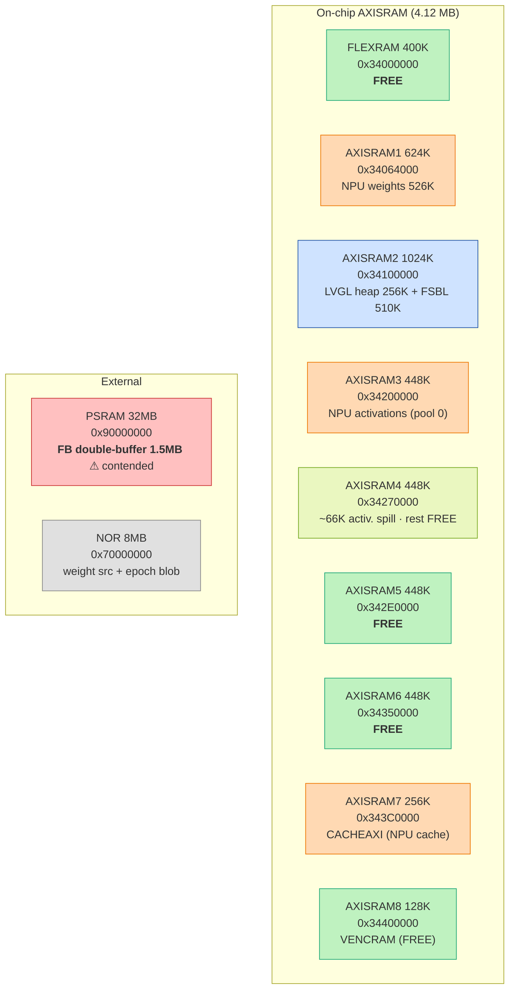
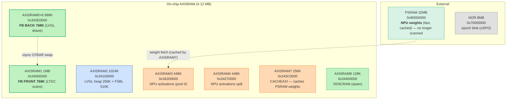

# run-23 — AXISRAM Memory Map & Framebuffer-in-SRAM Redesign

> Maintained view of the on-chip SRAM bank layout for the LTDC-framebuffer-in-SRAM effort
> (the real fix for the NPU↔LTDC scanout-contention flicker — move the FB off the shared PSRAM
> path into a dedicated on-chip bank the NPU doesn't touch). Total on-chip AXISRAM = **4.12 MB**.

## Budget — does a full-color FB fit in SRAM?

| Consumer | Size | Notes |
|---|---|---|
| FSBL code (ROM) | 460 K | runs from AXISRAM2 |
| FSBL data/bss/stack (RAM) | 50 K | AXISRAM2 |
| NPU weights | 526 K | `network_weights.bin`, currently `memcpy`'d NOR→AXISRAM1 |
| NPU activations (global pool 0) | 514 K | AI_RAM @ `0x34200000` (AXISRAM3 + ~66 K into AXISRAM4) |
| NPU epoch blob | 494 K | `network_atonbuf_xSPI2.bin` — lives in **NOR** (xSPI2), not SRAM |
| LVGL heap | 256 K | AXISRAM2 |
| **Framebuffer (RGB565, 800×480)** | **768 K** | ×2 for double-buffer |
| **On-chip total used** | **~1.8 MB** | vs **4.12 MB** available → **~2.3 MB headroom** |

**Verdict:** a 768 K single-buffer FB fits in on-chip SRAM today with no NPU/FSBL/weights change;
a 1.5 MB double-buffer FB fits by relocating the weights out of AXISRAM1 (→ PSRAM, cached).

## Design principle — what can be PSRAM-assisted, what must be 100% SRAM

The system may exceed on-chip SRAM overall by keeping **burst/cacheable data in PSRAM and staging it
through on-chip SRAM as a middle buffer** (the CACHEAXI/SRAM7 cache) — this is fine for anything
accessed in bursts:

| Data | Access pattern | Home | On-chip assist |
|---|---|---|---|
| **NPU weights** | loaded per inference, cacheable | **PSRAM** `0x90000000` (faster than NOR) | **CACHEAXI / SRAM7** = the SRAM middle buffer |
| NPU activations | working set, hot | AXISRAM3-4 (on-chip) | — |
| **Display framebuffer** | **continuous scanout, every scanline, 60 Hz** | **100% on-chip SRAM (AXISRAM)** | **none — CANNOT be PSRAM-staged** |

**The framebuffer is the one thing that cannot use the PSRAM-assisted / SRAM-middle-buffer scheme.**
The LTDC re-reads the *entire* frame continuously; there is no burst locality to cache, so any
PSRAM staging stalls the scanout on a miss — which is precisely the starvation glitch we are removing.
The FB must therefore be **fully resident in directly-LTDC-scannable SRAM**. Everything else may lean
on PSRAM+cache to free SRAM for it.

## Target — double-buffer, full-color, 100% SRAM (the reference pattern)

> **Requirement:** the solution is **double-buffered** (keep the tear-free vsync swap) and full-color
> RGB565. Single-buffer is **not** an acceptable solution — at most a throwaway bring-up sanity check.
> This layout is intended as the **reference memory architecture for future LVGL bare-metal + NPU
> projects on STM32N6.**

Total on-chip AXISRAM **4.12 MB** vs the full double-buffer working set:

| Consumer | Size | Bank (target) |
|---|---|---|
| FB **front** (LTDC scans) | 768 K | **AXISRAM1** `0x34000000` |
| FB **back** (LVGL draws) | 768 K | **AXISRAM5-6** `0x342E0000` |
| FSBL code+data+stack | 510 K | AXISRAM2 |
| LVGL heap | 256 K | AXISRAM2 |
| NPU activations | 514 K | AXISRAM3(+4) |
| NPU weights | 526 K | AXISRAM4/7 (on-chip) **or** PSRAM+CACHEAXI |
| **Total** | **3.34 MB** | ✅ < 4.12 MB |

**The one prerequisite:** both FB buffers need a dedicated ≥768 K bank each, so **AXISRAM1 must be
freed of the NPU weights** (front buffer goes there). Two ways, both need a network re-gen because the
weight base is baked into the compiled network:

- **(B) 100% SRAM — preferred for the reference:** re-pack weights+activations into AXISRAM3-4-7. No
  PSRAM at all → the cleanest, most portable pattern (works on N6 parts without PSRAM populated).
- **(A) FB-in-SRAM, weights in PSRAM+CACHEAXI:** simpler re-gen (weights pool → PSRAM `0x90000000`,
  cached by SRAM7). FB is still 100% SRAM; only the bursty weights lean on PSRAM (allowed by the
  design principle above). Good fallback if (B)'s re-pack is awkward.

Either way the **framebuffer is 100% in dedicated NPU-free SRAM banks**, double-buffered — that is the
reusable pattern.

## Bank sizes (RM0486 Table 2)

| Bank | Address | Size | Port |
|---|---|---|---|
| FLEXRAM (FlexMEM) | `0x34000000` | 400 K | AXI_IC1_L1 (lower AXISRAM1) |
| AXISRAM1 (cpuRAM1) | `0x34064000` | 624 K | AXI_IC1_L1 |
| AXISRAM2 | `0x34100000` | 1024 K | AXI_IC1_L2 |
| AXISRAM3 | `0x34200000` | 448 K | AXI_IC1_L3 |
| AXISRAM4 | `0x34270000` | 448 K | |
| AXISRAM5 | `0x342E0000` | 448 K | |
| AXISRAM6 | `0x34350000` | 448 K | |
| AXISRAM7 / CACHEAXI | `0x343C0000` | 256 K | NPU weight/activation cache |
| AXISRAM8 / VENCRAM | `0x34400000` | 128 K | free when video encoder idle |

> Note: S alias `0x34000000` and NS alias `0x24000000` are the **same physical RAM** (RM §3.5.1 —
> "physically aliased"). TrustZone gives access control, not extra RAM.

## Current layout

## Proposed layout — Tier 2 (double-buffer, full color, 100% on-chip scanout)

**Why it's glitch-free:** the LTDC scans AXISRAM1/5-6 on their own fast AXI slave ports while the NPU
hammers AXISRAM3-4 (activations) + PSRAM (weights, cached). No shared slow-PSRAM bottleneck on the
scanout path → no starvation, full color, 60 Hz, no gate. This is the reference's memory philosophy
(weights out of the scanout path, D-cache on) taken to completion.

## Change set to implement

All steps are **additive** on top of the stabilized D-cache + gate build — the gate stays as a runtime
fallback (`g_npu_gate`), never deleted; D-cache, the input-clean coherency, and the line-event vsync
swap are untouched. FB base becomes a config, not a rewrite.

| Step | Change | Risk |
|---|---|---|
| Enable banks | ensure AXISRAM1/4/5/6 powered (`RAMCFG` — AXISRAM2-6 can be shut down in Run mode) | low |
| RISAF | grant LTDC master read access to the FB banks (AXISRAM1 + AXISRAM5-6) | low |
| Port | `lvgl_port_n6`: take **explicit front + back FB addresses** (instead of front + fixed +1 MB offset) so the two buffers can sit in different banks | low |
| **Re-gen** | free AXISRAM1: atonn mempool → **(B)** weights+activations in AXISRAM3-4-7 (100% SRAM), or **(A)** weights → PSRAM+CACHEAXI. *User step (AI Studio); then `/regen-fix`.* | medium |
| **Deliver** | FB double-buffer: front `0x34000000` (AXISRAM1), back `0x342E0000` (AXISRAM5-6); drop the weights `memcpy` to `0x34064000` | low |
| Verify | on-camera A/B, gate off — scanout clean through inference at full color | — |
| Retire gate | once proven, default `g_npu_gate=0` (code kept as fallback) | low |

**Optional bring-up sanity check (not the solution):** a temporary single-buffer at `0x342E0000` can
confirm the LTDC scans AXISRAM cleanly before the re-gen — but the delivered solution is always the
double-buffer above.
