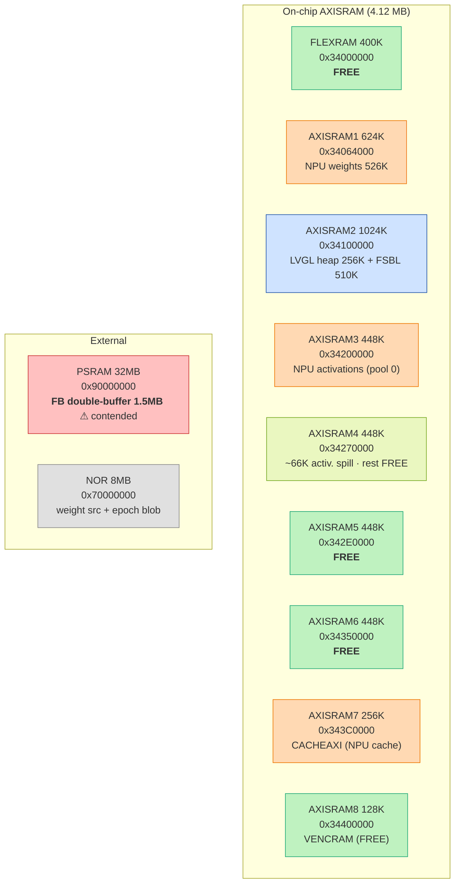
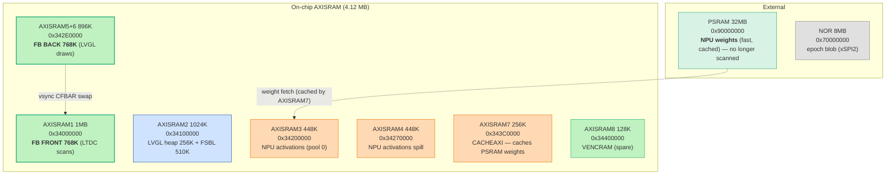

# run-23 — AXISRAM Memory Map & Framebuffer-in-SRAM Redesign

> Maintained view of the on-chip SRAM bank layout for the LTDC-framebuffer-in-SRAM effort
> (the real fix for the NPU↔LTDC scanout-contention flicker — move the FB off the shared PSRAM
> path into a dedicated on-chip bank the NPU doesn't touch). Total on-chip AXISRAM = **4.12 MB**.

## Budget — does a full-color FB fit in SRAM?

| Consumer | Size | Notes |
|---|---|---|
| FSBL code (ROM) | 460 K | runs from AXISRAM2 |
| FSBL data/bss/stack (RAM) | 50 K | AXISRAM2 |
| NPU weights | 526 K | `network_weights.bin`, currently `memcpy`'d NOR→AXISRAM1 |
| NPU activations (global pool 0) | 514 K | AI_RAM @ `0x34200000` (AXISRAM3 + ~66 K into AXISRAM4) |
| NPU epoch blob | 494 K | `network_atonbuf_xSPI2.bin` — lives in **NOR** (xSPI2), not SRAM |
| LVGL heap | 256 K | AXISRAM2 |
| **Framebuffer (RGB565, 800×480)** | **768 K** | ×2 for double-buffer |
| **On-chip total used** | **~1.8 MB** | vs **4.12 MB** available → **~2.3 MB headroom** |

**Verdict:** a 768 K single-buffer FB fits in on-chip SRAM today with no NPU/FSBL/weights change;
a 1.5 MB double-buffer FB fits by relocating the weights out of AXISRAM1 (→ PSRAM, cached).

## Design principle — what can be PSRAM-assisted, what must be 100% SRAM

The system may exceed on-chip SRAM overall by keeping **burst/cacheable data in PSRAM and staging it
through on-chip SRAM as a middle buffer** (the CACHEAXI/SRAM7 cache) — this is fine for anything
accessed in bursts:

| Data | Access pattern | Home | On-chip assist |
|---|---|---|---|
| **NPU weights** | loaded per inference, cacheable | **PSRAM** `0x90000000` (faster than NOR) | **CACHEAXI / SRAM7** = the SRAM middle buffer |
| NPU activations | working set, hot | AXISRAM3-4 (on-chip) | — |
| **Display framebuffer** | **continuous scanout, every scanline, 60 Hz** | **100% on-chip SRAM (AXISRAM)** | **none — CANNOT be PSRAM-staged** |

**The framebuffer is the one thing that cannot use the PSRAM-assisted / SRAM-middle-buffer scheme.**
The LTDC re-reads the *entire* frame continuously; there is no burst locality to cache, so any
PSRAM staging stalls the scanout on a miss — which is precisely the starvation glitch we are removing.
The FB must therefore be **fully resident in directly-LTDC-scannable SRAM**. Everything else may lean
on PSRAM+cache to free SRAM for it.

## ✅ Perfect fit — everything in SRAM, PSRAM optional

Total on-chip AXISRAM **4.12 MB** vs the full working set:

| Config | FSBL+heap | NPU (weights+activ.) | FB | **Total** | Fits 4.12 MB? |
|---|---|---|---|---|---|
| **Single-buffer** | 766 K | 1040 K | 768 K | **2.57 MB** | ✅ **today, no re-gen** |
| **Double-buffer** | 766 K | 1040 K | 1536 K | **3.34 MB** | ✅ with NPU re-pack |

- **Single-buffer, 100% SRAM, no re-gen:** FB → AXISRAM5-6; weights stay AXISRAM1, activations AXISRAM3. **PSRAM entirely unused** for the working set → the contention source is gone.
- **Double-buffer, 100% SRAM:** re-gen the NPU to pack weights+activations into AXISRAM3-4-7 (weights no longer need CACHEAXI since they're on-chip), freeing AXISRAM1 for FB-front; FB-back in AXISRAM5-6. Still **no PSRAM** — the true perfect fit.

The PSRAM-assist (weights in PSRAM + CACHEAXI middle buffer) from Tier 2 is only a fallback if the NPU
re-pack proves awkward. **If it all fits in SRAM, we keep it 100% on-chip and drop PSRAM from the
critical path entirely.**

## Bank sizes (RM0486 Table 2)

| Bank | Address | Size | Port |
|---|---|---|---|
| FLEXRAM (FlexMEM) | `0x34000000` | 400 K | AXI_IC1_L1 (lower AXISRAM1) |
| AXISRAM1 (cpuRAM1) | `0x34064000` | 624 K | AXI_IC1_L1 |
| AXISRAM2 | `0x34100000` | 1024 K | AXI_IC1_L2 |
| AXISRAM3 | `0x34200000` | 448 K | AXI_IC1_L3 |
| AXISRAM4 | `0x34270000` | 448 K | |
| AXISRAM5 | `0x342E0000` | 448 K | |
| AXISRAM6 | `0x34350000` | 448 K | |
| AXISRAM7 / CACHEAXI | `0x343C0000` | 256 K | NPU weight/activation cache |
| AXISRAM8 / VENCRAM | `0x34400000` | 128 K | free when video encoder idle |

> Note: S alias `0x34000000` and NS alias `0x24000000` are the **same physical RAM** (RM §3.5.1 —
> "physically aliased"). TrustZone gives access control, not extra RAM.

## Current layout

## Proposed layout — Tier 2 (double-buffer, full color, 100% on-chip scanout)

**Why it's glitch-free:** the LTDC scans AXISRAM1/5-6 on their own fast AXI slave ports while the NPU
hammers AXISRAM3-4 (activations) + PSRAM (weights, cached). No shared slow-PSRAM bottleneck on the
scanout path → no starvation, full color, 60 Hz, no gate. This is the reference's memory philosophy
(weights out of the scanout path, D-cache on) taken to completion.

## Change set to implement

| Step | Change | Risk |
|---|---|---|
| Enable banks | ensure AXISRAM4/5/6 powered (`RAMCFG`, they can be shut down in Run mode) | low |
| RISAF | grant LTDC master read access to the FB bank(s) | low |
| **Tier 1** | FB single-buffer → `0x342E0000` (AXISRAM5-6); LTDC CFBAR + `lv_conf.h`/`lcd.c` | low — validates the whole theory |
| **Tier 2a** | weights: drop the `memcpy` to AXISRAM1; run from **PSRAM** `0x90000000` (faster than NOR XIP), cached by CACHEAXI. Needs atonn re-gen with weights pool = xSPI1/PSRAM | medium |
| **Tier 2b** | FB double-buffer: front `0x34000000` (AXISRAM1), back `0x342E0000` (AXISRAM5-6) | low |

**Validate Tier 1 first** (single buffer in AXISRAM5-6) — it proves FB-in-SRAM kills the glitch with
the smallest change, before the weights→PSRAM re-gen for the full double-buffer.
