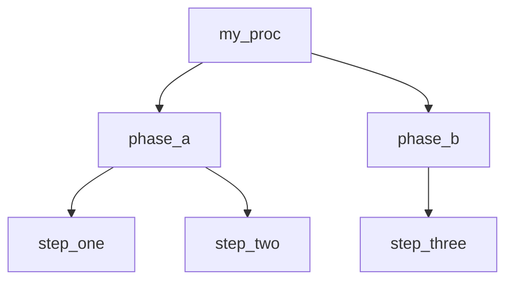

# Grammar Tools — `model_tools_grammar.py`

`model_tools_grammar.py` converts external source documents into the two files
that `model_create_hf_cl.py` needs to learn a new procedure grammar:

| Output file | Purpose |
|---|---|
| `training/train_<name>_commands.json` | Command vocabulary (token names → shell/Python commands) |
| `grammars/playbook_<name>.txt` | BNF grammar (procedure hierarchy, tab-completion tree) |

---

## Quick start

```bash
# 1. Convert a source document
python model_tools_grammar.py examples/grammar_sources/kali_discovery.md --summary

# 2. Load the generated files into the AI model
python model_create_hf_cl.py \
    --train  training/train_kali_discovery_commands.json \
    --grammar grammars/playbook_kali_discovery.txt

# 3. Run the procedure at the CLI prompt
>>> kali_discovery
```

---

## Supported source formats

| Format | Extension(s) | Auto-detected | Converter class |
|---|---|---|---|
| Mermaid flowchart | `.mmd`, `.mermaid` | ✅ | `MermaidGrammarConverter` |
| Markdown | `.md`, `.markdown` | ✅ | `MarkdownGrammarConverter` |
| Plain text spec | `.txt`, `.rst`, `.spec` | ✅ | `TextGrammarConverter` |
| PDF | `.pdf` | ✅ (requires `pypdf`) | `PDFGrammarConverter` |
| Web page | `http://`, `https://` | ✅ | `WebGrammarConverter` |
| AI-assisted | any above | via `--ai-model` flag | `ModelAssistedGrammarConverter` |

Format is inferred from the file extension and (for `.txt`) by peeking at the
first 1 KB. Override with `--format` if auto-detection is wrong.

---

## Mermaid flowchart (`.mmd`)

Define the procedure hierarchy as a flowchart. Attach commands to leaf nodes
using `%% cmd:` comment annotations — the diagram stays valid Mermaid.

### Format



**Rules:**
- `%% cmd: token_name = command string` — maps a leaf token to its command.
  Multiple spaces around `=` are allowed.
- **Label-as-command** — if the node ID is already `snake_case` and the bracket
  label looks like a shell command, the label becomes the command value:
  ```
  phase_a --> step_one["echo hello && date"]
  ```
- `%% cmd:` annotations take priority over label-derived commands.
- Nodes with outgoing edges become grammar **rules**; leaf nodes become **tokens**.
- If there are multiple root nodes, the converter injects a synthetic root using
  the `--grammar` name.

### Example

```bash
python model_tools_grammar.py examples/grammar_sources/network_scan.mmd --summary
python model_tools_grammar.py examples/grammar_sources/kali_discovery.mmd
```

---

## Markdown (`.md`)

Three-level heading hierarchy maps directly to the grammar tree.
Bullet items provide the actual commands.

### Format

```markdown
# grammar_name

## rule_group_a

### sub_rule_one
- token_alpha: `shell command here`
- token_beta: `another command`

### sub_rule_two
- token_gamma: `command`

## rule_group_b
- direct_token: `command`
```

**Heading levels:**
| Level | Role |
|---|---|
| `#` H1 | Grammar name (derived from text if `--grammar` not given) |
| `##` H2 | Top-level rule group |
| `###` H3 | Sub-rule (children are bullet tokens) |

**Bullet syntax:**
- `- name: command` — token name + command (backticks optional)
- `- name` — token name only (command stays empty until filled manually)

**Python exec mode** — fenced code blocks under an H3 become multi-line
Python source as the token value:

```markdown
### check_os
```python
import platform
print(platform.system(), platform.release())
```
```

Load these with `--exec python`:
```bash
python model_tools_grammar.py examples/grammar_sources/python_sysinfo.md \
    --exec python
```

### Example

```bash
python model_tools_grammar.py examples/grammar_sources/disk_maintenance.md
python model_tools_grammar.py examples/grammar_sources/kali_discovery.md --summary
```

---

## Plain text specification (`.txt`)

No markup required. The converter recognises the structural conventions most
specification documents already use.

### Recognised patterns

| Line pattern | Becomes |
|---|---|
| `1. SECTION TITLE` | Depth-1 grammar rule |
| `1.1  Sub-section` or `1.1. Sub-section` | Depth-2 grammar rule |
| `ALL CAPS LINE` or `Title\n====` | Grammar name (if before first numbered section) |
| `Step 1: name — command` | Command token (`—` em-dash separator) |
| `Step 1: name: command` | Command token (colon separator, short name) |
| `• name: command` / `→ name — command` | Command token |
| `name: command` (inside a section) | Command token (colon separator) |

**Name/command splitting rules:**
- The em-dash (`—`) is the clearest separator and is always preferred.
- Colon (`: `) is used only when the left side is a short clean phrase
  (≤ 3 words, no slashes, colons, or IP-address patterns).
- Prose lines and metadata in the document preamble (before the first numbered
  section) are treated as plain text and ignored.

### Template

```
PROCEDURE DOCUMENT TITLE
========================
Version X.Y — brief description

This introductory paragraph is ignored by the parser.

1. FIRST PHASE
==============

1.1  Sub-procedure Name
    Brief description (also ignored).

    Step 1: token_one   — actual shell command here
    Step 2: token_two   — another command
    Step 3: token_three — third command

1.2  Another Sub-procedure

    Step 1: token_four — command
    Step 2: token_five — command

2. SECOND PHASE
===============

2.1  Sub-procedure

    Step 1: token_six — command
```

### Example

```bash
python model_tools_grammar.py examples/grammar_sources/kali_discovery_spec.txt --summary
```

**Tip:** for dense or loosely-structured specifications where the step
boundaries are not explicit, use `--ai-model` instead (see below). The AI
path understands document intent, not just formatting patterns.

---

## PDF (`.pdf`)

Requires `pip install pypdf`. Text is extracted page by page; then the same
heuristics as the plain text converter are applied (heading detection by
ALL-CAPS / short lines, bullet detection).

Quality varies with the PDF's text layer. Scanned PDFs without OCR produce
no output. For complex PDFs, the AI-assisted path usually gives better results.

```bash
pip install pypdf
python model_tools_grammar.py procedure_manual.pdf --grammar my_proc --summary
python model_tools_grammar.py procedure_manual.pdf --ai-model qwen2:7b
```

---

## Web page (URL)

Fetches the page with `urllib` and walks the HTML structure to infer headings
(`<h1>`–`<h3>`) and list items (`<li>`). Works well on documentation sites
with clean semantic markup; results vary on marketing or heavily JavaScript-
rendered pages.

```bash
python model_tools_grammar.py https://example.com/runbook --grammar my_runbook
```

---

## AI-assisted mode (`--ai-model`)

Any Ollama model can interpret the source document and return structured
grammar data. This is the best option for:
- Dense technical manuals with implicit structure
- PDFs with inconsistent heading styles
- Documents where step boundaries depend on context (not formatting)
- Any source where the heuristic converters produce noise

```bash
# List available models first
python model_tools_grammar.py --list-models

# Convert using an AI model
python model_tools_grammar.py procedure.txt --ai-model qwen2:7b
python model_tools_grammar.py manual.pdf    --ai-model llama3
python model_tools_grammar.py https://wiki.example.com/sop --ai-model mistral
```

**Options:**

| Flag | Default | Description |
|---|---|---|
| `--ai-model NAME` | — | Ollama model name (enables AI mode) |
| `--ai-host URL` | `http://127.0.0.1:11434` | Ollama host |
| `--ai-max-chars N` | `6000` | Max source characters sent to the model |

The model receives a structured extraction prompt asking it to return JSON with:
- A `__rules__` key containing the procedure hierarchy
- One key per token mapping to its command string

Longer documents should be chunked or summarised before conversion if they
exceed `--ai-max-chars`.

---

## CLI reference

```
python model_tools_grammar.py [source] [options]
```

| Argument / Flag | Default | Description |
|---|---|---|
| `source` | — | File path or URL to convert |
| `--format / -f` | `auto` | `mermaid` \| `markdown` \| `text` \| `pdf` \| `web` \| `auto` |
| `--grammar / -g NAME` | auto | Grammar name (overrides auto-detection) |
| `--exec / -e MODE` | `shell` | `shell` \| `python` — execution mode for tokens |
| `--output / -o DIR` | project layout | Output directory (overrides default split) |
| `--dry-run` | off | Print generated files to stdout, write nothing |
| `--summary` | off | Print a short summary of the parsed structure |
| `--ai-model / -M NAME` | — | Ollama model for AI-assisted extraction |
| `--ai-host URL` | `http://127.0.0.1:11434` | Ollama host |
| `--ai-max-chars N` | `6000` | Max source chars sent to model |
| `--list-models` | — | List Ollama models and exit |

**Default output paths** (when `--output` is omitted):

```
training/train_<grammar>_commands.json   ← command vocabulary
grammars/playbook_<grammar>.txt          ← BNF grammar
```

These match the project's file layout so the generated files can be passed
directly to `model_create_hf_cl.py` without moving them.

---

## Integration with `model_create_hf_cl.py`

The tool prints the exact load command after conversion:

```
Generated:
  Vocabulary  training/train_kali_discovery_commands.json
  Grammar     grammars/playbook_kali_discovery.txt

Load into the model:
  python model_create_hf_cl.py \
      --train   training/train_kali_discovery_commands.json \
      --grammar grammars/playbook_kali_discovery.txt
```

Once loaded, the grammar name becomes available at the interactive CLI:

```
>>> kali_discovery              # run the full procedure
>>> kali_discovery <TAB>        # expand one level
>>> kali_discovery system_identity <TAB>   # expand deeper
```

To make a grammar the permanent default, add both files to `INIT_KNOWLEDGE_FILES`
in `model_create_hf_cl.py`.

---

## Same procedure, three source formats

The `kali_discovery` example is provided in three formats that all produce
equivalent output (10 rules, 21 tokens):

| File | Format | Notes |
|---|---|---|
| [kali_discovery.mmd](../examples/grammar_sources/kali_discovery.mmd) | Mermaid | `%% cmd:` annotations, best for visual diagrams |
| [kali_discovery.md](../examples/grammar_sources/kali_discovery.md) | Markdown | H2/H3/bullet, best for human-readable runbooks |
| [kali_discovery_spec.txt](../examples/grammar_sources/kali_discovery_spec.txt) | Plain text | Numbered sections + `Step N: name — cmd`, best for formal SOP docs |

```bash
python model_tools_grammar.py examples/grammar_sources/kali_discovery.mmd   --dry-run
python model_tools_grammar.py examples/grammar_sources/kali_discovery.md    --dry-run
python model_tools_grammar.py examples/grammar_sources/kali_discovery_spec.txt --dry-run
```

All three produce the same `train_kali_discovery_commands.json` and
`playbook_kali_discovery.txt`.

---

## Self-test

```bash
# Run all built-in tests (no Ollama required)
python examples/test_grammar_tools.py

# Verbose output (show every check)
python examples/test_grammar_tools.py --verbose

# Also test AI-assisted extraction
python examples/test_grammar_tools.py --ai-model qwen2:7b
```

---

## Extending the tool

Each converter is a class in [classes/class_tools_grammar.py](../classes/class_tools_grammar.py)
that inherits from `BaseGrammarConverter`:

```python
from classes.class_tools_grammar import BaseGrammarConverter

class MySourceConverter(BaseGrammarConverter):
    def parse(self):
        # populate self._rules (OrderedDict: name → [child_names])
        # populate self._tokens (OrderedDict: name → command_string)
        pass
```

`BaseGrammarConverter` provides:
- `to_vocabulary_dict()` → JSON-ready dict with `_type`, `_grammar`, `_exec`, tokens
- `to_grammar_text()` → BNF text with `<rule> ::= <child>` and `<tok> ::= "tok"` lines
- `generate(output_dir)` → writes both files, returns `(json_path, bnf_path)`
- `_sanitize(text)` → converts any string to a valid `snake_case` token name
- `summary()` → human-readable parse summary

Register your converter in `model_tools_grammar.py`:
```python
from classes.class_tools_grammar import MySourceConverter
# ...
_map["mysource"] = MySourceConverter
```
