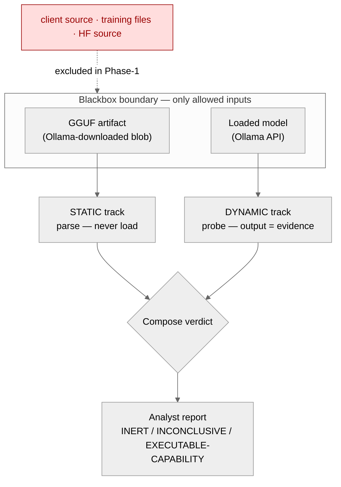
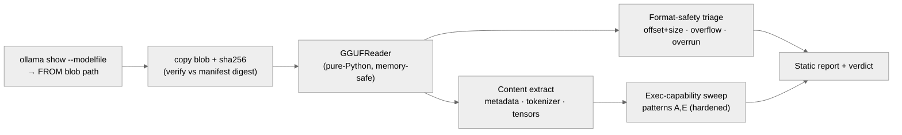
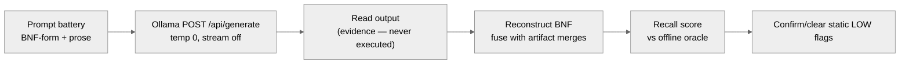
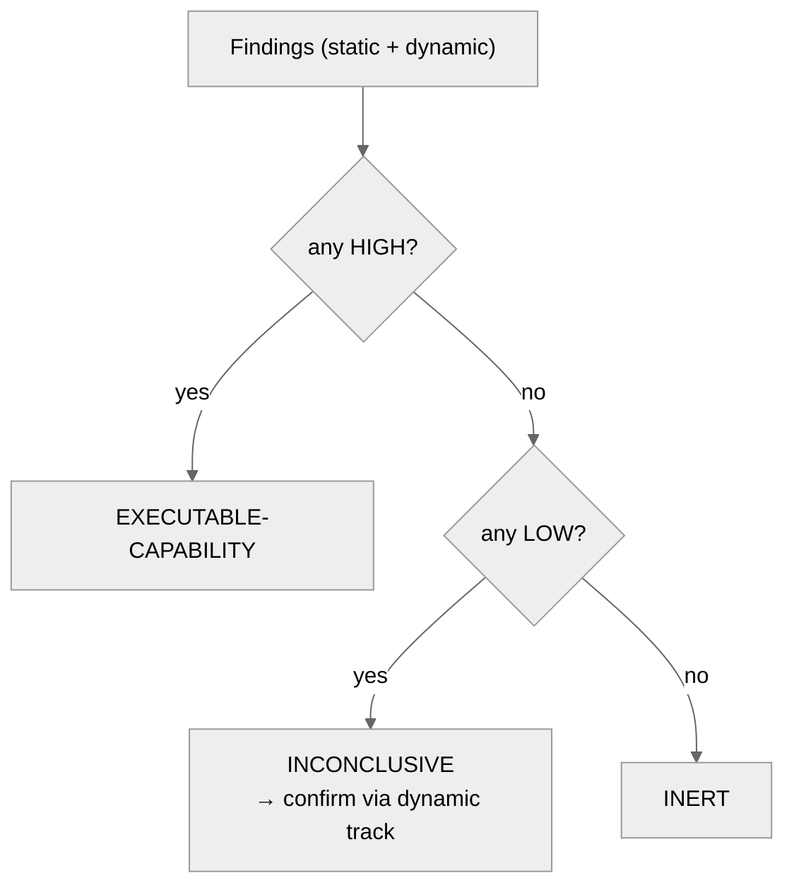

# Blackbox Model Security RE — Static & Dynamic Analysis

Host-only methodology to reverse-engineer a model that is **ready to load** (downloaded and served
by Ollama), to **extract its content**, judge **security issues from that content**, and decide
whether it **encodes a command/code-execution capability**. Two complementary tracks:

| Track | What it does | Runs the model? |
|---|---|---|
| **Static** | Parses the Ollama-downloaded GGUF file | **No** — artifact only |
| **Dynamic** | Queries the loaded model live, treats output as evidence | Yes — read-only, output never executed |

**Blackbox trust boundary (hard rule).** Both tracks use **only** (a) the model artifact and
(b) live query access. They never read the client/app source, the training files, or the HF source
(those are later *whitebox* phases). Grammar reconstruction **discovers its own symbols from the
model** (vocab merges) — a real analyst auditing an unknown model has only the model.

**Independent code.** The RE/security tooling is **new code written for analysis**, not a reuse of
the host model-creation solution — its only dependencies are the external `gguf-py` parsing library
and the Ollama API. It generalises across GGUF model types (**qwen2 / llama / mistral**), not just
the NPU calculator model.

Tooling: [`model_security_re.py`](../model_security_re.py) (CLI) +
[`classes/class_model_security.py`](../classes/class_model_security.py) (analysis classes).



---

## Static track — tools, APIs, libraries, techniques

The artifact is parsed in **pure Python** — we deliberately do **not** hand the file to llama.cpp's
native loader first, because that C parser carries live memory-corruption CVEs
(**CVE-2025-53630** and its bypass **CVE-2026-27940** — integer overflow → heap OOB / code-exec on
load). Static analysis stays in a memory-safe reader.



| What | Tool / API / library | Where | Why |
|---|---|---|---|
| GGUF parsing | **`gguf.GGUFReader`** (llama.cpp `gguf-py`, pure-Python) | vendored `llama.cpp/gguf-py` | memory-safe read of header / metadata KV / tensor table — no native deref |
| Metadata dump (manual) | **`gguf_dump.py`** | `llama.cpp/gguf-py/gguf/scripts/` | first-pass human dump of KV + tensors |
| Acquisition | **`ollama show --modelfile`** (Ollama CLI) | `subprocess` | resolves the `FROM` blob path + `TEMPLATE` + `PARAMETER`s of the downloaded model |
| Chain-of-custody | **`hashlib.sha256`** (stdlib) | `class_model_security.py` | hash the blob, verify it against the Ollama manifest digest |
| Token decode | **GPT-2 byte-level decoder** (technique) | `gpt2_decode()` | the tokenizer is `gpt2`; decode byte-level tokens to readable text |
| Encoded-payload test | **`base64`, `binascii`, `math` (Shannon entropy)** (stdlib) | `ExecCapabilityDetector` | distinguish a real encoded blob from a dictionary word |
| Pattern matching | **`re`** (stdlib) | detector | command/code signatures over vocab + metadata |

**Techniques:**
- **Format-safety triage** (CVE-2025-53630 / -27940 class): for every tensor, verify
  `data_offset + n_bytes ≤ file_size`, check **shape-product overflow** (uint64 wrap), and detect
  **cumulative-region overrun** (the wrap-around undersizing pattern). Done from `GGUFReader`
  metadata only — the model is never loaded.
- **Content extraction**: all metadata KV, the full tokenizer (tokens/scores/types/merges), the
  tensor inventory (name/shape/dtype/bytes/offset), and the Ollama template.
- **BPE-merge grammar leak**: the merge table reassembles the training grammar's vocabulary
  (e.g. `te+rm→term`, `ex+pr→expr`, ` fac+tor→ factor`) — partial structure recovery from the
  artifact alone.
- **Exec-capability sweep** (patterns A & E, see below).

---

## Dynamic track — tools, APIs, libraries, techniques



| What | Tool / API | Where | Why |
|---|---|---|---|
| Live inference | **Ollama HTTP API** `POST /api/generate` (`localhost:11434`) | `urllib.request` (stdlib) | deterministic queries: `stream:false`, `temperature:0`, `num_predict` |
| Model inspection | **`ollama show --modelfile / --template / --parameters`** | CLI | the template is the client-side injection surface |
| Red-team probes *(named, Phase-1+)* | **garak** (NVIDIA) | external (pip) | jailbreak / prompt-injection / prompt-extraction probes |

**Techniques:**
- **Model-only symbol discovery** (`discover_symbols`): seeds for reconstruction are derived from
  the **artifact's own vocab** (the BPE merges assemble candidate symbols like `term`, `expr`,
  `factor`). Never seeded from host grammar files — the analyst bootstraps from the model itself.
- **Grammar reconstruction by prompt battery**: probe each discovered symbol with a **mixed
  battery** — BNF-form (`<factor> ::=`) **and** prose (`A factor is`). Prose escapes the temp-0
  attractor that collapses BNF prompts onto the dominant rule; together they raise rule recall.
- **Recall scoring (self-test only)**: scoring against `grammars/playbook_model_calculator.txt` is
  valid **only because we built this model**. It is never an input to reconstruction — a real
  engagement against an unknown model has no oracle.
- **Output-is-evidence rule**: nothing the model emits is ever executed — no client runner in the
  loop. We only read the text.

> **Honesty note on current state:** the dynamic probing today is **hand-rolled via the Ollama
> API** (the prompt battery above). **garak / OWASP-LLM-Top-10 / MITRE-ATLAS** are the named
> frameworks for the red-team layer and the risk mapping — they are wired in next, not yet run.

---

## Exec-capability detector — patterns & hardening

The verdict "does this model encode a command/code-execution capability?" is decided from the
artifact (static) and confirmed by behavior (dynamic). Patterns:

| # | Pattern | Signal source |
|---|---|---|
| A | command/code-token encoding (`os.system`, `subprocess`, `/bin/sh`, `import os`, …) | vocab + merges |
| B | code/command emission in live output | dynamic |
| C | execution-directed template/metadata (tool/function-calling) | metadata + template |
| D | action-sequence grammar (procedure that drives execution) | reconstructed grammar |
| E | obfuscated/encoded payloads (base64/hex → command/code) | vocab + decode |
| F | combined-risk score (emits executable content a client would auto-run) | A–E composed |

**Hardening (learned from real false positives on the calculator model):**
- **BPE sub-word fragments** — `rm` is flagged only as **LOW** confidence because it is almost
  always the fragment of `te`+`rm`→**term**, not the shell command. Short dangerous words are
  LOW + *"confirm dynamically"*; only multi-char unambiguous signatures (`subprocess`,
  `os.system`, `/bin/sh`) are **HIGH**.
- **Dictionary-word / identifier base64** — `calculator` and CamelCase identifiers like
  `InitializeComponent` matched a naive base64 check. Hardened: a candidate must carry a **digit or
  `+`/`/`/`=` (or be hex)** — pure-alpha is a word/identifier, not a payload — **and** decode to
  **Shannon entropy ≥ 4.0**.
- **Model-class awareness (from generalising to qwen2/llama/mistral)** — a general LLM's 150k-token
  vocab *always* contains `import`, `system`, `exec`, `subprocess`, `curl`… because it was trained
  on code. So on a **general** model (vocab ≥ 1024) pattern-A words are **baseline noise** (counted,
  not per-token flagged); the meaningful exec signal is **pattern C** (the chat-template's
  tool/function-calling) plus behaviour. On a **minimal/grammar** model a curated vocab makes
  pattern A meaningful. The detector classifies the model and weights signals accordingly.

**Worked contrast:** `model_calculator_test_npu` (vocab 374, minimal) → only `[A/LOW] rm` →
**INCONCLUSIVE → confirm dynamic → INERT**. `qwen2.5:0.5b` (vocab 151,936, general) →
`[C/HIGH]` tool-calling template + `[A/HIGH] subprocess/PowerShell` →
**EXECUTABLE-CAPABILITY** (a true positive: a general model *is* code-capable).

**Verdict ladder:** `HIGH present → EXECUTABLE-CAPABILITY` · `only LOW → INCONCLUSIVE (confirm via
dynamic)` · `none → INERT`.



---

## Frameworks & later-phase tools (named, not all wired yet)

| Purpose | Reference |
|---|---|
| App-layer risk taxonomy | **OWASP Top-10 for LLM Applications** |
| Adversarial TTP knowledge base | **MITRE ATLAS** |
| Governance | **NIST AI RMF** |
| LLM red-team probes | **garak** (NVIDIA) |
| Serialization-attack scanning *(Phase-2 whitebox, pickle in HF source)* | **ModelScan** (Protect AI), **picklescan**, **fickling** (Trail of Bits) |

GGUF itself is **not** pickle, so ModelScan/picklescan/fickling apply to the upstream *conception*
files (`.bin`/`.pt`) in the later whitebox phase — not to the blackbox GGUF.

---

## Reproduce

```bash
# STATIC — parse the Ollama-downloaded file, no model load
python3 model_security_re.py static  --ollama model_calculator_test_npu
python3 model_security_re.py static  --gguf model_calculator_version_1.gguf

# DYNAMIC — live behavioral probing + grammar reconstruction
python3 model_security_re.py dynamic --ollama model_calculator_test_npu \
        --rules expr term factor number digit
```

## Worked example — `model_calculator_test_npu` (calculator grammar)

- **Static:** format-safety OK (27 tensors, offsets in-bounds, no overflow); alphabet = digits
  `0-9` + ops `( ) * + - / =`; BPE merges leak `expr/term/factor/number/digit`. Exec sweep:
  one `[A/LOW] rm` (BPE fragment) → verdict **INCONCLUSIVE → confirm dynamically**.
- **Dynamic:** nonterminals recovered 5/5; `term` and `factor` rules recovered verbatim; model
  **recalls the grammar, does not compute** (`3+4=` ≠ `7`); emits only grammar fragments, never a
  command → confirms **INERT**.
- **Composed verdict:** the static LOW flag is resolved by the dynamic track to **inert / no
  executable capability** — the intended clean negative.

---

## Roadmap

**Phase 2 — advanced payload discovery (blackbox, harder signals).** Once confident on the basic
patterns, evolve the detector toward:
- **Crypted / obfuscated payloads** — beyond base64/hex: XOR/rot/gzip/zlib layers, split-and-
  reassemble tokens, homoglyph/unicode-escape smuggling, weights-encoded payloads.
- **Detection-evasion techniques** — recognise content shaped to slip naive scanners (low-entropy
  encodings, benign-looking templates that compose into execution, staged/multi-turn payloads).
- **C2 backchannel indicators** — detect a model whose content/behaviour encodes
  command-and-control hints: hardcoded hosts/IPs/onion URLs, beacon-like output patterns,
  exfiltration directives, or tool-call schemas pointed at attacker infrastructure.

**Phase 3 — whitebox, conception-files-up.** Reverse from the conception files (HF `safetensors`
internals, training provenance), run serialization scanners (**ModelScan / picklescan / fickling**)
on any pickle, and resolve grammar alias-tokens to their real command strings. Out of the Phase-1
blackbox boundary; the Stage-2 provenance hook stubs the entry point.

These build on the **combined-technique** analysis: a compromised client/host that executes model
output is the other half of the chain — modelled to train the detector, never required to flag the
model-side capability.
