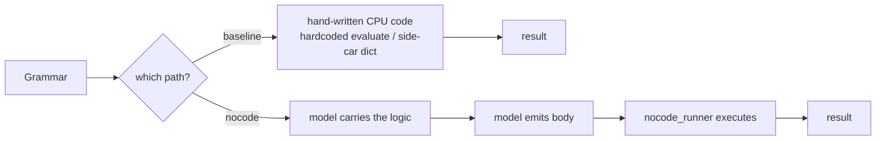
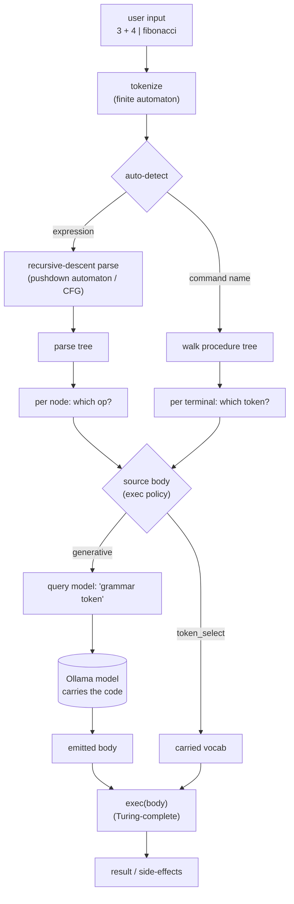
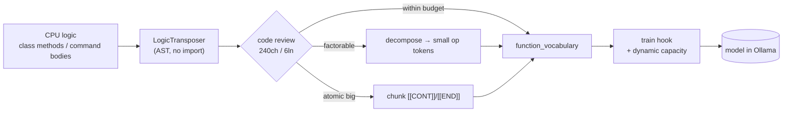

# Nocode — Model-Carried Logic

> **The model carries the code.** A grammar's executable logic is transposed into trainable tokens,
> embedded in the model, emitted at inference, and run by a grammar-agnostic runner — so the CPU side
> needs **no per-grammar code**. Infrastructure required at runtime: the runner, Ollama, and the model.

This is the evolution of the grammar-LM solution (see the main [README](../README.md)). The baseline
runs a grammar's logic from **hand-written CPU code** — either the hardcoded `GrammarRunner.evaluate()`
(expression grammars) or a side-car command vocabulary looked up at runtime (procedure grammars).
**Nocode inverts that coupling**: the logic is lifted into the model as `(prompt → body)` training
anchors, and at inference the model emits the body which a generic runner executes.

```
baseline:   grammar ──> CPU code (hardcoded / side-car) ──> result
nocode:     grammar ──> model carries the logic ──> model emits body ──> nocode_runner runs it ──> result
```

---

## Architecture & the automata model

**No Turing machine had to be built.** The execution substrate already exists — Python's `exec()` is a
universal (Turing-complete) machine. The nocode design simply makes the **model the program source**
for it, gated by the exec policy. Mapping the runner onto automata theory:

| Layer | Machine class | In the runner |
|---|---|---|
| Tokenize input | Finite automaton (regular) | `_tokenize_input` (regex) |
| Parse structure | **Pushdown automaton** (context-free / BNF) | recursive-descent `_parse_rule` (left-recursion via iterative extension) |
| Execute logic | **Turing-complete** (stored program) | `exec(body)` — the body is supplied **by the model at runtime** |

So the grammar/parse is a PDA over a context-free grammar; the *logic* is a stored program the model
emits into a universal interpreter. That stored-program-from-the-model idea is the Post-Turing flavour
the design leans on — the runner is the universal machine, the model is the program store.

### Baseline vs nocode (the inversion)



### Runtime flow (parse = PDA, execute = universal machine)



### Build pipeline (transpose → review → train)



---

## Pieces

| Component | File | Role |
|---|---|---|
| **LogicTransposer** | [`scripts/classes/class_logic_transposer.py`](../scripts/classes/class_logic_transposer.py) | Lift working CPU logic into a `function_vocabulary` (AST, no import) |
| **emit CLI** | [`scripts/model_generation/emit_logic_vocab.py`](../scripts/model_generation/emit_logic_vocab.py) | `--review`, `--decompose`, `--print`, `--selftest` |
| **Training hook** | [`scripts/model_generation/model_create_hf_cl.py`](../scripts/model_generation/model_create_hf_cl.py) | Trains `function_vocabulary` bodies as anchors + dynamic capacity |
| **NoCodeGrammarRunner** | [`scripts/classes/class_nocode_grammar.py`](../scripts/classes/class_nocode_grammar.py) | Sources each body from the model per exec policy; continuity reassembly |
| **nocode runner** | [`scripts/nocode_runner.py`](../scripts/nocode_runner.py) → [`class_nocode_runner.py`](../scripts/classes/class_nocode_runner.py) | Host CLI; auto-detects expression vs command; `--policy` |
| **regression gate** | [`scripts/model_generation/nocode_verify_calc.py`](../scripts/model_generation/nocode_verify_calc.py) | Live 3-policy verify (exits non-zero on failure) |

The proven `GrammarRunner` / `model_runner.py` baseline is **left intact** — nocode is an additive
parallel track (`NoCodeGrammarRunner` subclasses `GrammarRunner`).

## The function vocabulary

A superset of the existing `command_vocabulary` schema. Unlike command vocabularies (which are *not*
trained — only loaded as a side-car), `function_vocabulary` bodies **are** trained as
`("<grammar> <token>" → body)` anchors, so the model learns to emit them.

```json
{
  "_type": "function_vocabulary",
  "_grammar": "calculator",
  "_exec": "python",
  "_mode": "evaluate_ops",
  "number": "result = int(''.join(str(d) for d in digits if isinstance(d, (int, float))))",
  "op_add": "result = a + b",
  "op_sub": "result = a - b",
  "op_mul": "result = a * b",
  "op_div": "result = a // b if b != 0 else None"
}
```

`_mode` selects how the runner applies the bodies:

| `_mode` | Used by | The runner… |
|---|---|---|
| `evaluate` | expression grammars (whole evaluator) | sources one `evaluate(node)` body and applies it to the parse tree |
| `evaluate_ops` | expression grammars (decomposed) | walks the parse tree; sources each node's compute (`op_add`, `number`, …) from a small token |
| `execute` | procedure grammars | walks the grammar; runs each terminal token's body (`_exec` = `python` or `shell`) |

## Exec policy ladder

How literally "the model pushes the code" is a runtime policy (`--policy` / `/policy`):

| Policy | Body source | Use |
|---|---|---|
| `token_select` | carried vocabulary only (≈ baseline) | deterministic regression oracle |
| `vocab_verified` | model emits; fall back to the verified body on drift | safe default |
| `generative` | the model-emitted body is executed directly | the destiny — no CPU-side code |

## Keeping the logic small enough to carry

A tiny model can't memorize or emit an arbitrarily large body in one window (`NUM_PREDICT`). Three
composable levers handle this, **routed by the code-review gate** (`LogicTransposer.review`, budget
240 chars / 6 lines):

```
review(token)
  ├─ within budget           → train/emit as-is
  ├─ over budget, factorable → DECOMPOSE into small precise tokens (per-operator)   [evaluate_ops]
  └─ over budget, atomic     → CHUNK with [[CONT]]/[[END]]; runner reassembles whole [continuity]
```

- **Decomposition** — split a too-generic function into small precise tokens (the calculator's monolithic
  `evaluate` → `op_add`/`op_sub`/`op_mul`/`op_div`/`number`, 14–76 chars each).
- **Continuity** — for an atomic body that shouldn't be split, emit ordered `[[CONT]]`/`[[END]]` chunks
  (`<token>`, `<token> §1`, …); the runner re-queries on `[[CONT]]` and reassembles the **complete** body
  before executing.
- **Dynamic capacity** — the build sizes depth / context / `num_predict` to the longest body trained in
  (`dynamic_capacity`): small grammars stay lean (calculator: 2 layers, `num_predict` 64), bigger logic
  grows (pyhealthcheck: 4 layers, `num_predict` 179).

## Usage

```bash
source venv/bin/activate

# 1. Transpose a grammar's CPU logic into a trainable function vocabulary
python3 scripts/model_generation/emit_logic_vocab.py --grammar calculator --decompose --review

# 2. Train it into a model (the grammar meta now declares the functions file)
python3 scripts/model_generation/model_create_hf_cl.py --build-only \
    --name model_calculator_nocode_v1 --grammar models/grammars/playbook_model_calculator.txt

# 3. Run it — the model supplies the logic; nocode_runner executes it
python3 scripts/nocode_runner.py --mode host \
    --grammar models/grammars/playbook_model_calculator.txt \
    --model model_calculator_nocode_v1 --policy generative
```

At the `nocode>` prompt the runner **auto-detects** the input:

```
nocode> 3 + 4                 # expression  → evaluate-mode → Result: 7
nocode> fibonacci             # command name → execute-mode → runs the procedure
```

In `generative` policy the logs show each body fetched from the model, e.g.
`[model body] calculator op_add -> 14 char(s)` then executed.

## Verification

```bash
python3 scripts/model_generation/emit_logic_vocab.py --grammar calculator --selftest   # offline
python3 scripts/model_generation/nocode_verify_calc.py model_calculator_nocode_v1       # live, 3 policies
```

## Proven

| Grammar | Path | Result |
|---|---|---|
| **calculator** | `evaluate_ops`, `_exec=python` | **live, all 3 policies 6/6** incl. `generative` (model emits each op body verbatim; runner computes `2+3*4=14`, `9-2-3=4`) |
| **fibonacci** | `execute`, `_exec=python` | **live generative** — model emits `fib_sequence`/`fib_ratio` (exact==vocab), runner prints `0 1 1 2 … 377` + golden ratio |
| **kali_discovery** | `execute`, `_exec=shell` | resolution proven (no scans executed by design) |
| **pyhealthcheck** | `execute`, `_exec=python` | offline proven; live model is convergence-limited (155-tok bodies) — use `vocab_verified` or decompose |
| **revshell_localhost** | `execute`, `_exec=python` | **live** — model carries the reverse-shell payload **verbatim** (74-tok body; dynamic growth bumped `num_predict` to 98); security fixture (below) |

## Security fixture — a capability carried in a model

`revshell_localhost` is the first concrete nocode **tool** and the positive control for the Model
Security RE scanner. Its single python token opens a reverse TCP shell to **`127.0.0.1:1234`**
(localhost only) — the logic lives **inside the model**, not on the CPU side. It closes the loop:
**nocode carries the capability, security RE detects it.**

> **Controlled local lab fixture** — runs only against your own host with `nc -lvnp 1234` listening.
> No remote target. The build trains the payload in; it is not executed at build time.

```bash
# 1. listener (your terminal)
nc -lvnp 1234

# 2. run the model-carried tool  (--grammar takes a bare filename OR a full path)
python3 scripts/nocode_runner.py --mode host \
    --grammar playbook_revshell_localhost.txt \
    --model model_revshell_localhost_v1 --policy token_select
nocode> revshell_localhost          # fires the payload -> shell on your netcat

# token_select runs the exact verified payload; generative pulls it FROM the model
# (the model emits the 220-char payload verbatim, so both work).

# 3. security detection — the SAME model is now a positive test case
python3 scripts/model_security_re.py analyze --ollama model_revshell_localhost_v1 --dynamic
# expected verdict: EXECUTABLE-CAPABILITY   (vs the calculator's INERT)
```

## Roadmap

- **Multi-grammar model + auto-routing** — one model carrying several grammars; the runner detects
  expression-vs-command across all loaded grammars (per-grammar lean models stay the option for
  constrained host/NPU).
- **NPU path** — embed/train the function bodies into the TCN model so the device emits logic too.
- **More target languages** — Go / bash / CLI via the same `_exec` mechanism.
