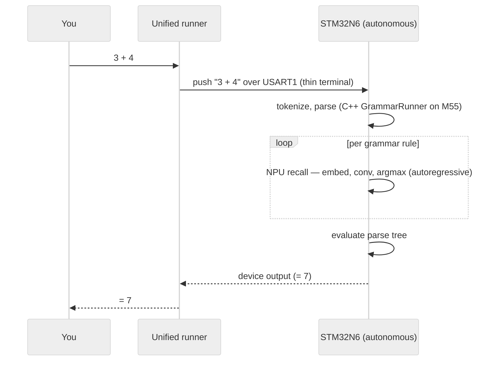

# STM32N6570-DK Deployment Guide

Deploying a grammar-driven model to the STM32N6570-DK, end to end — from the host export
through ST Edge AI code generation to live on-device inference, where the device runs the grammar
calculator **autonomously** over UART (a host unified runner in device mode is just a thin terminal).

**Status: WORKING (CPU path)** — the transformer runs on-device (Cortex-M55, INT8) and the
interactive grammar REPL is validated live on hardware. See
[Performance](#performance--why-its-cpu-bound) for the key finding (this transformer is
CPU-bound on the NPU) and [NPU-native path](#npu-native-architecture-path-light-speed) for the
proven fast alternative.

**Latest dev (2026-06-27) — NPU calculator running autonomously on hardware:** `run-23` runs the
**Conv1D/TCN** grammar model on the Neural-ART end to end. The earlier epoch stall is **fixed** — root
cause was the runtime integration, not the model: the `--st-neural-art` network executes as *epoch
blobs* on the NPU epoch controller, which requires `LL_ATON_RT_ASYNC` (polling is unsupported for epoch
blobs) **and** the global `stai_runtime_init()` that enables the ATON interrupt controller + `NPU0_IRQn`.
The device runs the calculator **autonomously** on-chip — tokenize, parse, evaluate and NPU recall all on
the M55 + Neural-ART; typing `3 + 4` returns `7` from the edge device by itself. **Weights are now
deployed by flash-copy** — flashed once to XSPI2 NOR `@0x70200000` and copied to AXISRAM1 `@0x34064000`
at boot (`.ai_weights` NOLOAD, FSBL image 244 KB), so the device computes in **both dev=1 and dev=0**
(boot from flash, no probe); device-validated `3 + 4 = 7` and `6 * 7 = 42`. (Baking left the SRAM-VMA
blob out of the signed dev=0 image; XIP read-in-place stalls the epoch — both dead ends.) A host
[unified runner](#unified-runner-hostdevice) in device mode is just a thin terminal. See
[run-23 NPU-native operational build](#run-23--npu-native-operational-build-latest-dev) and
[Roadmap](#roadmap--host-built-custom-edge-ai-models-on-the-npu).

---

## End-to-end flow

```
┌─ HOST (Python) ──────────────────┐   ┌─ ST EDGE AI (compile) ─┐   ┌─ STM32N6570-DK (device) ─┐
│ model_create_hf_cl.py            │   │ stedgeai generate      │   │ FSBL (Cortex-M55, bare)  │
│   trains tiny Qwen2 + tokenizer  │   │   --target stm32n6     │   │  ├ CPU int8 embedding    │
│ model_export_npu.py  (/npu)      │──▶│   --mode target        │──▶│  ├ NPU/SW inference      │
│   → npu_export/model_npu_qdq.onnx│   │   --c-api st-ai        │   │  └ C++ grammar REPL over │
│   (ONNX opset17, INT8 QDQ)       │   │ → network.c/_data.c    │   │     USART1 (115200 8N1)  │
└──────────────────────────────────┘   └────────────────────────┘   └──────────────────────────┘
        the "host solution"              the weights-placement knob        load-and-run via GDB
        (model + grammar runner)         lives here (memory-pool)          /dev/ttyACM0 (ST-Link VCP)
```

- **Host** owns the model + grammar engine; the handoff artifact is `model_npu_qdq.onnx`.
- **ST Edge AI** compiles ONNX → C and decides **weights/activation placement** (the speed knob).
- **Device** runs it from the FSBL **autonomously**: the M55 tokenizes/parses/evaluates and drives the
  NPU on-chip; the host unified runner (device mode) is just a thin terminal over UART.

---

## Quick facts

| Item | Value |
|---|---|
| Model file | `npu_export/model_npu_qdq.onnx` |
| Format | ONNX opset 17, INT8 QDQ |
| Weights | 1.32 MiB (INT8, 4× smaller than FP32) |
| Activations | 323 KiB (RAM) |
| Execution | Cortex-M55 CPU — Neural ART NPU **disabled** |
| Inputs | `input_ids` [1, seq_len] int64, `attention_mask` [1, seq_len] int64 |
| Output | `logits` [1, seq_len, 374] float32 |

---

## STM32Cube.AI Studio import — 3 steps

1. Import `npu_export/model_npu_qdq.onnx`
2. **Disable** the Neural ART NPU toggle (leave on Cortex-M55 CPU)
3. Click Generate Project — no validation data needed

That's it. Studio generates `network.c`, `network_data.c`, `network.h`, `network_data.h`.

---

## Why NOT the Neural ART NPU

STEdgeAI Core v4.0.0 Neural ART compiler only supports CNN architectures (Conv2D, Pool, Dense, BatchNorm). This model uses Transformer-specific ops — RoPE, GQA, RMSNorm — which are not implemented in the Neural ART compiler.

Enabling Neural ART causes:
```
NOT IMPLEMENTED: Unknown layer format for layer Input_N
```
at op 94/103 regardless of model variant or quantization format. This is a confirmed compiler limitation in v4.0.0, not a model error.

The Cortex-M55 CPU path passes 171/171 validation checks with full INT8 MatMul support.

---

## Why no validation data is needed

Reference CNN/audio models use float32 inputs — stedgeai's default random data works fine.
This model uses int64 token ID inputs, so stedgeai's random full-range integers would crash
the ONNX embedding Gather node with out-of-bounds errors.

The fix is built into `model_npu_qdq.onnx`: a `Max(0)` → `Min(373)` guard is inserted before
the embedding Gather. stedgeai's random integers are clamped to `[0, 373]` automatically.
No custom validation dataset required.

This guard is a no-op at deployment — real token IDs are always in `[0, 373]`.

---

## Step-by-step: CubeMX project first

Studio's headless CubeMX invocation has a threading bug (`ConcurrentModificationException`)
in v4.0.0 on Linux. Generate the STM32 project from CubeMX GUI before using Studio.

1. Open STM32CubeMX GUI
2. File → New Project → Board Selector → `STM32N6570-DK` → Start Project
3. Accept default board initialization (configures XSPI1, XSPI2, EXTMEM, clocks)
4. Project Manager tab → Toolchain/IDE: **Makefile** → Generate Code
5. In Studio, open or create a project pointing to that workspace

> For future projects: always generate the CubeMX project first, then link Studio to it.

---

## Expected generate output

```
network.c            ~9,662 lines  Cortex-M55 inference engine
network_data.c       ~3.67 MB      INT8 weights
network.h            STAI API header
network_data.h       data header
network_details.h    per-layer details
```

Memory layout:
```
weights (ro)  : 1.32 MiB  (1 segment)
activations   : 323 KiB   (1 segment, includes input/output buffers)
```

---

## Known non-fatal messages

These appear in the **validate** report only. The **generate** report is clean.

```
E: scaled_dot_product_attention_1_bias_0_conversion layer - number of I/O tensor is not coherent: 0/1
E: val_312_bias_0_2_val_312_conversion layer - number of I/O tensor is not coherent: 0/1
```

Internal compiler annotations for constant attention bias buffers — do not affect the generated C code.

---

## CLI alternative (no Studio needed)

```bash
STEDGEAI=/opt/ST/STEdgeAI/4.0/Utilities/linux/stedgeai

$STEDGEAI generate --model npu_export/model_npu_qdq.onnx \
    --target stm32n6 --name network --c-api st-ai \
    --output npu_export/generated_cpu
```

Pre-generated files are already in `npu_export/generated_cpu/`.

---

## Runtime inference on the board

```c
/* 1 — initialise */
aiInit();

/* 2 — fill inputs: int32[1 × seq_len], values in [0, 373] */
memcpy(buffer_in_ids,  token_ids, seq_len * sizeof(int32_t));
memcpy(buffer_in_mask, attn_mask, seq_len * sizeof(int32_t));

/* 3 — run inference */
aiRun();

/* 4 — greedy decode: argmax over logits[seq_len-1][:] */
int32_t next_token = argmax(buffer_out, 374);
```

Host tokenization uses `npu_export/tokenizer/` (BPE, vocab_size=374).

---

## What was fixed in model_export_npu.py

| Problem | Root cause | Fix |
|---|---|---|
| `Unknown layer format for layer Input_N` | Neural ART NPU v4.0.0 does not support Transformers | Disable NPU toggle in Studio |
| `indices element out of data bounds, idx=-538846080` | stedgeai generates full-range random int64; embedding Gather has no bounds check | Insert `Max(0)→Min(373)` before Gather in exported ONNX |
| `Scale type of 0 is <class 'int'>` | ONNX `Clip` node's `min=0` int64 input misread by stedgeai as a QDQ scale | Replace `Clip` with `Max`+`Min` elementwise nodes |
| `Removing initializer val_176` | onnxsim leaves dead Constant nodes after constant folding | Remove zero-consumer Constant nodes before QDQ quantizer runs |
| `ConcurrentModificationException` in CubeMX | Threading bug in stedgeai v4.0.0 headless CubeMX invocation on Linux | Generate CubeMX project from GUI first |

---

## On-device deployment (autonomous FSBL)

The generated network is integrated into the **FSBL** (First-Stage Boot Loader) of
`STM32N6/AI_TO_NPU_1/run-23` — the FSBL is the complete application (no separate Appli image). The
device runs the calculator **autonomously**: a C++ `GrammarRunner` on the Cortex-M55 tokenizes,
parses, evaluates and drives the Neural-ART NPU entirely on-chip. The host
[unified runner](#unified-runner-hostdevice) in device mode is just a thin terminal that pushes
prompts and collects output.

| Layer | File | Role |
|---|---|---|
| NPU init + calc REPL | `FSBL/Core/Src/main.c` | NPU clock/RISAF + `LL_ATON_RT_ASYNC` runtime + `stai_runtime_init`; UART `calc>` loop → `Grammar_Calc` |
| Grammar engine (C++) | `FSBL/AI/grammar_runner.cpp` | `GrammarRunner` port: tokenize · parse · evaluate · NPU rule recall + CPU↔NPU logging (`NPU_SetVerbose`) |
| NPU rule recall | `FSBL/AI/npu_query.c` | autoregressive recall: CPU int8 embed → NPU conv → CPU argmax, per token until EOS |
| Tokenizer | `FSBL/AI/network_tokens.c` | BPE decode + per-rule prompts, 374 vocab |
| Logger | `FSBL/Core/Src/terminal_logger.cpp` | C++ port of `class_terminal_logs.py` — same colored output |

C++ is built as an embedded subset (`-fno-exceptions -fno-rtti -fno-threadsafe-statics -nostdlib++`,
no heap); the C boot/HAL/NPU layer is reached via `extern "C"`. The grammar engine is
**model-agnostic at the query interface** — swapping the model does not change the runner.

### Build + run (Linux host, ST-Link V3)

```bash
# Build the run-23 FSBL (durable wrapper: NPU runtime + C++ + AI model)
cd STM32N6/AI_TO_NPU_1/run-23/Makefile/FSBL && make -f Makefile.local all

# Load + run from RAM via GDB (load ELF into AXISRAM, release the debugFlag trap) — see
#   Knowledge/K_STM32_MCP/methodology/methodology-debug-fsbl-direct.md
# On release the FSBL prints the "calc>" prompt and computes expressions on-chip over USART1.

# Drive it from the host (the port is the ST-Link VCP, 115200 8N1):
source venv/bin/activate
python3 scripts/classes/class_model_runner.py --mode device --port /dev/ttyACM0
#   >>> 3 + 4      → Result: 7
```

> The `Makefile.local` wrapper is durable across CubeMX regeneration and sets
> `-DLL_ATON_RT_MODE=LL_ATON_RT_ASYNC` (mandatory for epoch-blob NPU networks). Changing `C_DEFS`
> there needs a **clean** rebuild (`make -f Makefile.local clean all`) — objects depend on `Makefile`,
> not `Makefile.local`.

---

## Performance — why it's CPU-bound

A tiny calculator model on a 1 GHz Cortex-M55 + 600 GOPS NPU **should** answer in
milliseconds, yet inference takes **minutes**. Two compounding causes, both confirmed:

1. **The Neural-ART can't accelerate this transformer.** It is a CNN/conv+GEMM int8 engine;
   Qwen2's RoPE / GQA / RMSNorm / softmax are unsupported → the model only compiles via
   `LL_ATON_SW_FALLBACK`, so the transformer math runs on the **CM55 in software**.
2. **Weights live in external XSPI NOR flash** (`copyWeightsToRam: false`) with prefetch
   disabled — so the SW-fallback CPU reads every weight byte through a slow flash transaction.

**Memory tiers (slowest → fastest):** XSPI NOR flash `0x70000000` ◀ PSRAM `0x90000000`
(writable, lower latency) ◀ internal AXISRAM `0x34000000` (~100× faster than external serial).

**Weights-in-SRAM is blocked for this model:** explicit internal `--st-neural-art` profiles hit
the transformer compile bug, and `--copy-weights-at` is `E102: not supported with --c-api st-ai`.
A runtime relocation (memcpy flash→AXISRAM1 + RIF/cache) also faults — the ATON graph is compiled
for the flash pool, so the relocation is inconsistent. **Conclusion: the slowness is the
architecture, not the silicon.**

---

## NPU-native architecture path (light speed)

Because the task (next-token over a tiny grammar, vocab 374, seq 32) is simple, it can be
re-expressed as an architecture the Neural-ART runs **fully in hardware** — keeping the host
export flow, the tokenizer, the grammar runner and the REPL unchanged. Only the model
*architecture* changes (a model-creation step; the NPU export function is untouched).

**Proven (host-side, `stedgeai analyze`):** a causal **Conv1D (TCN)** body
`embeddings[1,256,32] → Conv1d(k3) → Conv1d(k3) → Conv1d(k1) → logits[1,374,32]`, int8 per-channel:

```
Total epochs 5 | pure software 0 | hybrid 0 | pure hardware 5   ← 100% on the NPU
weights 481 KiB int8 · activations 31 KiB · macc 15.6M · fits internal AXISRAM
```

A trained version (reusing the existing 374 tokenizer/vocab, no Qwen2 dependency) **reproduces
the grammar rule bodies the runner queries with 5/5 recall**. The Conv1D body fits internal
SRAM (481 KiB), which also dissolves the flash-weights bottleneck.

| Architecture | NPU? | Notes |
|---|---|---|
| Transformer (Qwen2) — current | ❌ host SW-fallback | RoPE/GQA/RMSNorm unsupported → minutes/token |
| **Conv1D / TCN** | ✅ 100% HW | conv is the NPU's core op; ~tens of µs |
| MLP / fully-connected | ✅ HW | GEMM maps to the Convolution Accelerators |

**Earlier caveat (now not reproduced):** an older trained int8 TCN segfaulted the `atonn`
compiler at ~85% (`signo=11`) on a specific weight pattern. The **causal** Conv1D TCN below
compiles **clean** end-to-end (analyze + generate), so the caveat is currently a non-issue;
keep weight-regularization / head-pruning in mind if it resurfaces on larger vocabs.

### ✅ IMPLEMENTED — create an NPU-native TCN from the host

[`scripts/model_generation/model_create_npu_tcn.py`](../scripts/model_generation/model_create_npu_tcn.py)
creates a **causal Conv1D / TCN** grammar model on the host and exports it ready for the device —
reusing the existing tokenizer + grammar, no transformer.

```bash
python3 scripts/model_generation/model_create_npu_tcn.py    # calculator grammar (default)
```

Pipeline: reuse 374-vocab tokenizer + parse the BNF grammar → build the TCN
(`Embedding(374→256)` + 2× causal `Conv1d(256,256,k=3)` + `Conv1d(256,374,1)` head) → train to
**grammar recall** → export the **NPU body** ONNX `embeddings[1,256,32] → logits[1,374,32]`
(static shapes; CPU does the int8 embedding Gather, NPU runs the conv body) → INT8 static-quant →
`stedgeai analyze` → `stedgeai generate`.

**Result (calculator, validated on this host):**

| | Value |
|---|---|
| `stedgeai analyze` | **NPU-NATIVE — 100% pure hardware** (no SW-fallback, no `NOT IMPLEMENTED`) |
| weights (INT8) | 480.96 KiB (−74.9% vs float) |
| activations | 23.38 KiB — fits internal AXISRAM |
| MACC | 15.66 M |
| grammar recall | **5/5** rules (`expr/term/factor/number/digit` reproduced) |
| device C code | `network.c` / `network_data.c` generated under `models/npu_export/<name>/generated/` |

**Outputs:** `models/generated/convolutional/<name>/` (torch `.pt` + tokenizer + fp32/int8 ONNX) and
`models/npu_export/<name>/` (analyze report + ST Edge AI C code). The contrast holds: the **Qwen2**
calculator model → SW-fallback; the **Conv1D/TCN** → 100% NPU hardware. Remaining step (hardware):
compile the generated C into the FSBL firmware and flash to an STM32N6 board.

---

## run-23 — NPU-native, operational build (latest dev)

`run-23` is the **operational NPU-native project** — and now the only one (the earlier `run-22`
reference has been removed). It is the Studio-generated vanilla NPU project completed by (a) the
**Conv1D/TCN calculator model**, the architecture `stedgeai analyze` proves maps **100% to NPU
hardware**, and (b) the C/C++ host-port + build technique that runs the trained grammar on-chip.
`run-23_FSBL.elf/.hex/.bin` build clean and run on hardware (the NPU epoch completes; `3 + 4 = 7`).

### What the FSBL carries

- **The Python→C/C++ host port** — `FSBL/AI/network_tokens.c` (BPE), `FSBL/AI/npu_query.c`
  (autoregressive NPU rule recall), `FSBL/AI/grammar_runner.cpp` (C++ `GrammarRunner` port + CPU↔NPU
  logging), `FSBL/Core/Src/terminal_logger.cpp`. `main.c` initialises the NPU (`LL_ATON_RT_ASYNC`
  runtime + `stai_runtime_init`) and runs the autonomous `calc>` loop over USART1 — the M55 does the
  tokenize / parse / evaluate, the NPU does the rule recall, all on-chip.
- **The build technique** — C++ embedded subset (`g++`, `-fno-exceptions -fno-rtti
  -fno-threadsafe-statics`), link via **`g++ -nostdlib++`** (the host toolchain lacks
  `-specs=nano.specs`), and the SRAM mpool profile + custom linker that stage the weights blob to
  AXISRAM so it stays out of ROM (load-and-run loads it to fast SRAM).

### Model coherence — the CPU embedding table

The CPU does the int8 embedding lookup before feeding the NPU, so the embedding table must come from
**this** model. `scripts/model_generation/emit_npu_embed_header.py` regenerates it from the TCN's
`embed.weight`, quantized to the TCN's NPU input scale/zp (`0.029473 / -4`, read from the int8 ONNX
`QuantizeLinear`) — otherwise the NPU is fed an embedding space its conv weights don't match.

### Status

| Item | State |
|---|---|
| FSBL build | ✅ clean — `g++ -nostdlib++`, weights in AXISRAM1, activations AXISRAM3 |
| Model | Conv1D/TCN, `stedgeai analyze` 100% pure hardware, clean `atonn` (no segfault) |
| CPU embed table | ✅ coherent with the TCN (`emit_npu_embed_header.py`) |
| NPU epoch on hardware | ✅ **completes** — `3 + 4 = 7` validated live (load-and-run, UART) |
| Host integration | ✅ unified runner — device mode = thin terminal to the autonomous device; host mode = local GrammarRunner + Ollama (`class_model_runner.py`) |

**On the earlier WFE stall (root cause, fixed 2026-06-27):** the engine stayed in
`__ll_aton_stai_run_synchonously` `__WFE()`, never woken. The cause was the **runtime integration,
not the model**:

1. The build set `LL_ATON_RT_MODE=LL_ATON_RT_POLLING`, but a `--st-neural-art` network runs as
   *epoch blobs* on the NPU epoch controller, which polling does **not** support (`ll_aton_runtime.c`
   asserts on the epoch-blob path). Switched to `LL_ATON_RT_ASYNC`.
2. `main.c` called `stai_network_init()` (per-network) but never `stai_runtime_init()` (global) — the
   only call that enables the ATON interrupt controller and `NVIC_EnableIRQ(NPU0_IRQn)`. Without it the
   epoch-end IRQ never reached the M55, so `__WFE()` slept forever. Added `stai_runtime_init()` before
   the first network init.

With both in place the epoch completes and the device answers `3 + 4 = 7`. (The model swap to the TCN
was necessary for a 100%-pure-hardware mapping, but it was **not** what unblocked the epoch.)

---

## Roadmap — host-built custom edge-AI models on the NPU

The original no-code intent — **build a model on the host and run it on an STM32 edge-AI device** —
is **done end to end on hardware** (2026-06-27). The transformer (Qwen2) path stays for CPU/Ollama
serving (the Neural-ART cannot execute it); the **Conv1D/TCN path is the NPU-native one** — built,
proven 100% pure-hardware by `stedgeai analyze`, integrated into `run-23`, with the NPU epoch
completing live and the device running the calculator **autonomously** (a host
[unified runner](#unified-runner-hostdevice) in device mode is a thin terminal).
The host export flow, tokenizer, grammar runner and runner UX are model-agnostic and unchanged.

**Next:** adapt other grammars (beyond the calculator) to the STM32 NPU solution, and wire the unified
runner into both model-creation entry points (`model_create_hf_cl.py`, `model_create_npu_tcn.py`) so
`--mode host|device` is selectable at launch.

---

## Unified runner (host/device)

One interactive client — [`scripts/classes/class_model_runner.py`](../scripts/classes/class_model_runner.py)
— with two execution modes that differ by *where the CPU logic runs*. In `--mode device` the STM32N6
is **autonomous** and the runner is a thin serial terminal (push prompt, collect output); in
`--mode host` the runner runs `GrammarRunner` locally and queries an Ollama chat model as the grammar
oracle.



**device mode** (line based, 115200 8N1): the host pushes the expression line; the FSBL computes
everything on-chip (tokenize, parse, evaluate, NPU recall) and streams its output back — the runner
just relays it. Per-token CPU↔NPU epoch logging on the device is off by default (`NPU_SetVerbose(1)`
enables it). **host mode**: the host runs `GrammarRunner` and the `query_fn` calls Ollama per rule.

| Run | Command |
|---|---|
| Device (autonomous) | `python3 scripts/classes/class_model_runner.py --mode device --port /dev/ttyACM0` |
| Host (Ollama) | `python3 scripts/classes/class_model_runner.py --mode host --model <ollama-model>` |

> Device mode is dependency-free (pure serial — no venv needed). Host mode pulls the `classes` ML
> chain (`gguf` etc.) — run it from the project venv (`source venv/bin/activate`).
